# Docker 勉強会資料

**対象者：** 情報システム部員（Docker初心者）  
**所要時間：** 80分  

---

## 目次

1. [Linuxコマンドの基本](#1-linuxコマンドの基本)
2. [Dockerの基本](#2-dockerの基本)
3. [Docker Hubとは](#3-docker-hubとは)
4. [Dockerコマンド](#4-dockerコマンド)
5. [hello-worldコンテナを動かしてみる](#5-hello-worldコンテナを動かしてみる)
6. [Dockerfile](#6-dockerfile)
7. [docker-compose](#7-docker-compose)
8. [ハンズオン：JupyterLab環境を構築する](#8-ハンズオンjupyterlab環境を構築する)
9. [ハンズオン：Dev Containerを使ってみる](#9-ハンズオンdev-containerを使ってみる)
10. [よく使うDockerコマンド一覧](#10-よく使うdockerコマンド一覧)
11. [FAQ](#11-faq)

---

## 1. Linuxコマンドの基本

Dockerはターミナル（コマンドライン）から操作します。Git Bashで使ったコマンドと同じものが使えます。

### よく使うコマンド

| コマンド | 意味 | 例 |
|---------|------|----|
| `pwd` | 現在のフォルダのパスを表示 | `/home/user/docker-jupyter` |
| `ls` | フォルダの中身を一覧表示 | ファイル・フォルダ名が並ぶ |
| `ls -la` | 隠しファイルも含めて詳細表示 | パーミッション・サイズも表示 |
| `mkdir フォルダ名` | フォルダを作成 | `mkdir notebooks` |
| `cd フォルダ名` | フォルダに移動 | `cd docker-jupyter` |
| `cd ..` | 1つ上のフォルダに移動 | |
| `cat ファイル名` | ファイルの内容を表示 | `cat docker-compose.yml` |

### ターミナルの開き方（Windows）

- **PowerShell：** スタートメニューで「PowerShell」を検索
- **Git Bash：** フォルダを右クリック →「Git Bash Here」
- **VS Codeのターミナル：** メニュー「ターミナル」→「新しいターミナル」

> **Git勉強会との共通点：** `pwd`・`ls`・`cd`・`mkdir` はGit Bashでも使ったコマンドです。Dockerのターミナル操作でも同じ感覚で使えます。

---

## 2. Dockerの基本

### Dockerとは

**Docker** は、アプリケーションとその動作環境をまるごとパッケージにして、**どこでも同じ環境を再現できる仕組み**です。

「自分のPCでは動くのに、別のPCでは動かない」という問題を解決します。

### なぜDockerが必要か

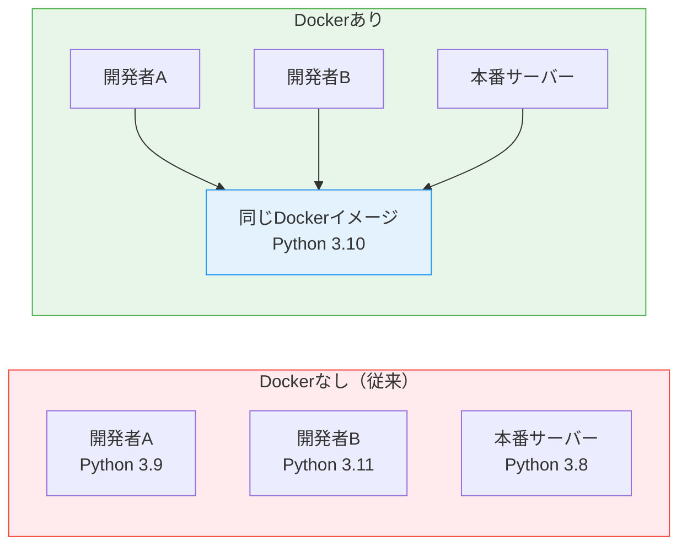

### イメージとコンテナの違い

Dockerを理解する上で最も重要な概念です。

| 概念 | たとえ | 説明 |
|------|--------|------|
| **イメージ** | 料理のレシピ | 環境の設計図。変更されない読み取り専用のファイル |
| **コンテナ** | レシピで作った料理 | イメージをもとに起動した実行環境。何個でも作れる |

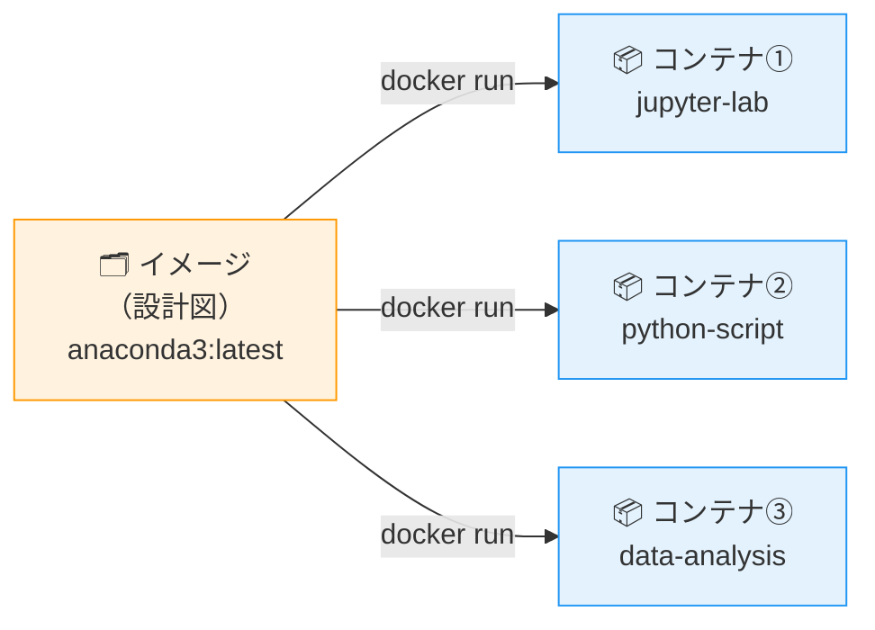

> **ポイント：** 1つのイメージから複数のコンテナを起動できます。コンテナを削除してもイメージは残ります。

### イメージとコンテナの「レイヤー（層）」構造

Dockerのイメージは **複数のレイヤー（層）が積み重なった構造** になっています。Dockerfileの命令（`FROM`・`RUN`・`COPY` など）ごとに1つのレイヤーが作られ、上に上にと重ねられていきます。

コンテナを起動すると、そのイメージの上にさらに **書き込み可能なレイヤー（コンテナレイヤー）** が1枚追加され、コンテナ内で行った変更（ファイル作成・パッケージインストールなど）はすべてその最上層に書き込まれます。

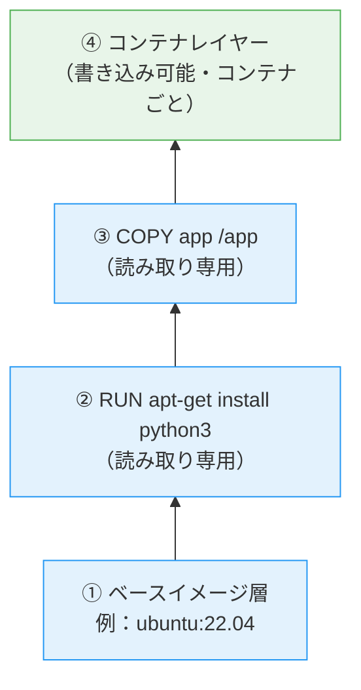

**レイヤー構造のメリット：**

| メリット | 説明 |
|---------|------|
| キャッシュが効く | Dockerfileを少し変更しても、変更前のレイヤーは再利用される → ビルドが速い |
| 容量を節約できる | 同じレイヤーを複数のイメージで共有する。`python:3.11` と `python:3.11-slim` で共通部分は1度しか保存されない |
| コンテナを軽く起動できる | 起動のたびにイメージ全体をコピーせず、上に書き込み層を1枚足すだけ |

**コンテナの書き込み層について：**

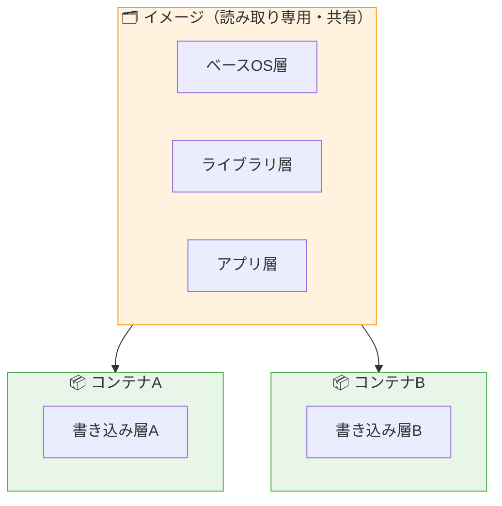

- イメージ部分（下層）は **読み取り専用** で、複数のコンテナで共有される
- 各コンテナは自分専用の **書き込み層** を持つ
- コンテナを `docker rm` で削除すると、書き込み層も一緒に消える（＝コンテナ内の変更は失われる）
- データを残したい場合は `volumes` でホストPCのフォルダをマウントする

> **ポイント：** Dockerfileの命令を書く順番でキャッシュ効率が大きく変わります。**変更が少ない命令を上に、変更が多い命令を下に** 書くのが基本です（例：`RUN pip install` を `COPY . /app` より先に書く）。

### DockerのアーキテクチャとホストOSの関係

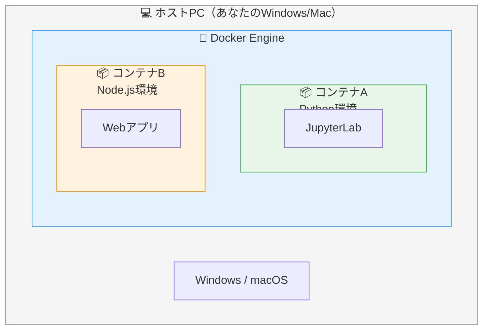

コンテナはホストOSの上で動くDocker Engineが管理しています。コンテナの中にはアプリとその実行に必要なものだけが入っており、ホストOSとは独立しています。

### GitとDockerの対比

Git勉強会で学んだ概念と対比すると理解しやすくなります。

| Git / GitHub | Docker / Docker Hub | 意味 |
|-------------|---------------------|------|
| ソースコード | イメージ | 管理対象のファイル |
| `git commit` | `docker build` | スナップショットを作る |
| `git push` | `docker push` | リモートに送る |
| `git pull` | `docker pull` | リモートから取得する |
| GitHub | Docker Hub | クラウド上の置き場所 |

---

## 3. Docker Hubとは

**Docker Hub** は、Dockerイメージを公開・共有するクラウドサービスです。GitHubがコードの置き場所であるように、Docker Hubはイメージの置き場所です。

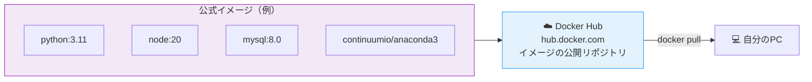

### Docker HubのURL

`https://hub.docker.com`

### 主な公式イメージ

| イメージ名 | 内容 |
|-----------|------|
| `python:3.11` | Python実行環境 |
| `node:20` | Node.js実行環境 |
| `mysql:8.0` | MySQLデータベース |
| `nginx:latest` | Webサーバー |
| `continuumio/anaconda3` | Anaconda（Python科学計算環境） |

> **`latest` タグ：** バージョンを指定しない場合に使われる「最新版」を意味するタグです。本番環境では具体的なバージョン（`python:3.11` など）を指定することが推奨されます。

---

## 4. Dockerコマンド

### コマンドの全体像

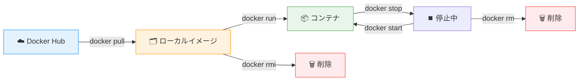

### 基本コマンド一覧

#### イメージの操作

```bash
# イメージをDocker Hubから取得する
docker pull イメージ名

# 例）Anacondaイメージを取得
docker pull continuumio/anaconda3

# ローカルのイメージ一覧を表示
docker images

# イメージを削除する
docker rmi イメージ名
```

#### コンテナの操作

```bash
# コンテナを作成して起動する（イメージがなければ自動でpull）
docker run イメージ名

# よく使うオプション付き
docker run -it イメージ名          # インタラクティブモードで起動（操作できる状態）
docker run -d イメージ名           # バックグラウンドで起動
docker run -p 8888:8888 イメージ名 # ポートを公開する（ホスト:コンテナ）
docker run -v /ホスト:/コンテナ イメージ名  # フォルダをマウント

# 実行中のコンテナ一覧
docker ps

# 全コンテナ一覧（停止中も含む）
docker ps -a

# コンテナを停止する
docker stop コンテナ名またはID

# コンテナを削除する
docker rm コンテナ名またはID

# 実行中のコンテナの中に入る
docker exec -it コンテナ名 bash
```

#### その他

```bash
# Dockerのバージョン確認
docker --version

# コンテナのログを確認
docker logs コンテナ名

# コンテナの詳細情報
docker inspect コンテナ名
```

### オプションの意味

| オプション | 意味 | 使う場面 |
|-----------|------|---------|
| `-it` | インタラクティブ + TTY | コンテナ内で直接操作したいとき |
| `-d` | デタッチ（バックグラウンド） | バックグラウンドで動かしたいとき |
| `-p ホスト:コンテナ` | ポートマッピング | ブラウザからアクセスするとき |
| `-v ホスト:コンテナ` | ボリュームマウント | ファイルをPC↔コンテナで共有するとき |
| `--name 名前` | コンテナに名前をつける | 後から操作しやすくするとき |

---

## 5. hello-worldコンテナを動かしてみる

Dockerが正しくインストールされているか確認し、最初のコンテナを実行します。

```bash
docker run hello-world
```

### 実行結果

```
Unable to find image 'hello-world:latest' locally   ← ローカルにないのでDocker Hubから取得
latest: Pulling from library/hello-world
...
Status: Downloaded newer image for hello-world:latest  ← ダウンロード完了

Hello from Docker!                                   ← コンテナが実行された
This message shows that your installation appears to be working correctly.
...
```

### 裏側で何が起きているか

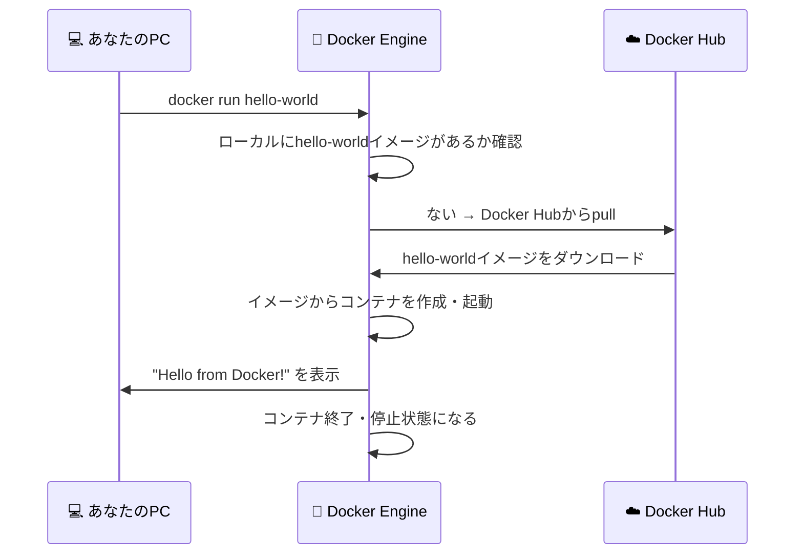

---

### コンテナの中に入ってLinuxコマンドを打ってみる

hello-worldは「メッセージを表示して即終了する」だけの最小限のイメージで、bashが入っていないためコンテナ内に入ることができません。コンテナ内を操作するには、bashが含まれるイメージが必要です。ここでは `ubuntu` イメージを使って実際にコンテナの中に入ってみます。

#### なぜhello-worldでbash操作できないのか

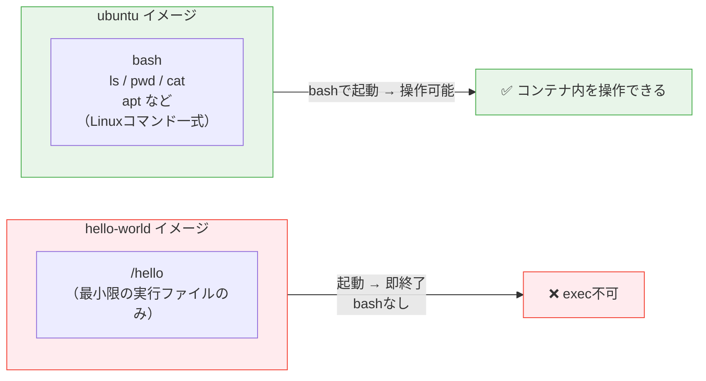

#### ubuntuコンテナを起動してbashに入る

```bash
# ubuntuコンテナをインタラクティブモードで起動してbashに入る
docker run -it ubuntu bash
```

`-it` オプションの意味：

| オプション | 意味 |
|-----------|------|
| `-i` | インタラクティブ（標準入力を有効にする） |
| `-t` | TTY（ターミナルとして扱う） |

実行すると、プロンプトが変わってコンテナ内に入った状態になります：

```
# 実行前（ホストのターミナル）
naisei4@DESKTOP-L2SFSCA MINGW64 ~/Projects

# 実行後（コンテナ内のbash）
root@a1b2c3d4e5f6:/#
```

`root@` の後の英数字がコンテナIDです。`/#` はコンテナ内のルートディレクトリを示します。

#### コンテナ内でLinuxコマンドを打ってみる

```bash
# 現在のフォルダを確認
pwd
# → /

# フォルダの中身を表示
ls
# → bin  boot  dev  etc  home  lib  ...

# ホームディレクトリに移動
cd /home
ls

# 新しいフォルダを作成
mkdir test-folder
ls
# → test-folder

# ファイルを作成して内容を書く
echo "Hello from container!" > hello.txt
cat hello.txt
# → Hello from container!

# OS情報を確認（Linuxであることがわかる）
cat /etc/os-release
# → NAME="Ubuntu"  VERSION="22.04.x LTS" ...

# Pythonのバージョンを確認（デフォルトでは入っていない）
python3 --version
# → bash: python3: command not found  ← ubuntuイメージには入っていない

# パッケージをインストールしてみる
apt-get update -q
apt-get install -y python3
python3 --version
# → Python 3.x.x

# コンテナから出る
exit
```

#### 停止したコンテナを再び起動して入り直す

`exit` でbashを抜けるとコンテナは停止します。停止したコンテナは削除されておらず、再度起動して入り直すことができます。

```bash
# 全コンテナ一覧で停止中のコンテナIDを確認
docker ps -a
# → STATUS "Exited (0)" の行のCONTAINER ID欄をメモする

# 停止中のコンテナを再起動
docker restart コンテナID

# 再起動したコンテナに入り直す
docker exec -it コンテナID bash
```

入り直したコンテナでは、先ほど作成した `test-folder` や `hello.txt`、インストールした `python3` がそのまま残っていることを確認できます。

```bash
# 先ほど作成したフォルダとファイルを確認
ls /home
cat /home/hello.txt

# インストールしたPythonも残っている
python3 --version

# 確認できたら再びコンテナから出る
exit
```

> **ポイント：** `docker run` は毎回新しいコンテナを作りますが、`docker restart` + `docker exec` は既存のコンテナをそのまま再利用するため、コンテナ内で行った変更が保持されています。コンテナを完全に削除したいときは次の手順で `docker rm` を使います。

#### コンテナを出た後の状態を確認する

```bash
# コンテナ一覧を確認（Exitedになっている）
docker ps -a
# → STATUS が "Exited (0)" になっている

# コンテナを削除する
docker rm コンテナID（またはコンテナ名）

# イメージは残っているか確認
docker images
# → ubuntu:latest は残っている
```

> **重要なポイント：** コンテナ内でインストールした `python3` は、そのコンテナを削除すると消えます。次回 `docker run -it ubuntu bash` で起動した新しいコンテナには `python3` は入っていません。**「コンテナは使い捨て可能な実行環境」** であることを体感できます。環境を永続化したい場合は Dockerfile に `RUN apt-get install -y python3` と記述します。

#### `docker run` と `docker exec` の使い分け

今回のようにコンテナを起動しながらbashに入る場合は `docker run -it` を使います。すでに起動中のコンテナに追加で入る場合は `docker exec -it` を使います。

```bash
# ① コンテナを起動しながらbashに入る（新規コンテナを作成）
docker run -it ubuntu bash

# ② バックグラウンドで起動中のコンテナに入る（既存コンテナに追加接続）
docker run -d --name my-ubuntu ubuntu sleep infinity   # バックグラウンドで起動しておく
docker exec -it my-ubuntu bash                         # 実行中のコンテナに入る
```

| タイミング          | コマンド                         | コンテナの状態     |
| -------------- | ---------------------------- | ----------- |
| コンテナを新規作成して入る  | `docker run -it イメージ bash`   | 新しく作られる     |
| すでに起動中のコンテナに入る | `docker exec -it コンテナ名 bash` | 起動中である必要がある |


### Dockerfileとは

**Dockerfile** は、Dockerイメージを「作る」ための設計書（レシピ）です。  
テキストファイルに命令を記述することで、自分だけのカスタムイメージを作れます。

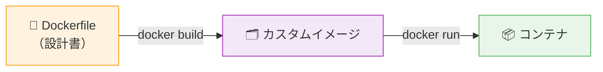

### Dockerfileの基本命令

| 命令        | 意味                      | 例                          |
| --------- | ----------------------- | -------------------------- |
| `FROM`    | ベースとなるイメージを指定（必須・最初に書く） | `FROM python:3.11`         |
| `RUN`     | イメージ作成時にコマンドを実行         | `RUN pip install pandas`   |
| `COPY`    | ホストのファイルをイメージにコピー       | `COPY . /app`              |
| `WORKDIR` | 作業ディレクトリを指定             | `WORKDIR /app`             |
| `CMD`     | コンテナ起動時に実行するコマンド        | `CMD ["python", "app.py"]` |
| `EXPOSE`  | コンテナが使用するポートを宣言         | `EXPOSE 8888`              |
| `ENV`     | 環境変数を設定                 | `ENV PORT=8888`            |
|           |                         |                            |

### Dockerfileの例（Flask Webアプリ）

JupyterLabは数百MBのインストールが必要で起動も遅いため、ここでは **JupyterLabよりはるかに軽量な Flask（数MBのPython Webフレームワーク）** を使った例を紹介します。リポジトリ直下の `Docker勉強会/Dockerfile` と `app.py` がそのまま使えます。

```dockerfile
# ベースイメージを指定（python:3.11-slim はフルイメージより約800MB軽い）
FROM python:3.11-slim

# 作業ディレクトリを設定
WORKDIR /app

# 必要なライブラリをインストール
# JupyterLab（数百MB）の代わりに、軽量Webフレームワークの Flask（数MB）を使う
RUN pip install --no-cache-dir flask

# Flask開発サーバーの設定
ENV FLASK_APP=app.py
ENV FLASK_DEBUG=1

# Flaskが使用するポートを公開
EXPOSE 5000

# コンテナ起動時に Flask 開発サーバーを起動
# --host=0.0.0.0 を指定することで、ホストPCのブラウザからアクセス可能になる
CMD ["flask", "run", "--host=0.0.0.0", "--port=5000"]
```

サンプルアプリ `app.py`（リポジトリ直下に配置済み）：

```python
from datetime import datetime
from flask import Flask

app = Flask(__name__)

@app.route("/")
def index():
    now = datetime.now().strftime("%Y-%m-%d %H:%M:%S")
    return f"<h1>Hello from Docker + Flask!</h1><p>現在時刻: {now}</p>"
```

> **ポイント：** JupyterLabのときに必要だったトークン無効化設定（`--ServerApp.token=` など）は、Flaskでは不要です。`flask run` は最初から認証なしで起動するため、`http://localhost:5000` にアクセスするだけで即座に開きます。

### イメージのビルドとホストフォルダのマウント実行

このDockerfileのポイントは **`COPY` を書いていない** ことです。代わりに `docker run -v` で **ホストPC側のフォルダをコンテナの `/app` にマウント** します。こうすることで、ホスト側で `app.py` を編集すると、コンテナ内のFlask開発サーバー（`FLASK_DEBUG=1` 設定済み）が自動でリロードしてくれます。

```bash
# Docker勉強会フォルダに移動
cd Docker勉強会

# Dockerfileからイメージをビルドする
docker build -t my-flask .
# -t : イメージに名前（タグ）をつける
# .  : 現在のフォルダのDockerfileを使う

# ビルドしたイメージを確認
docker images

# ホストの現在フォルダをコンテナの /app にマウントしてコンテナを起動
#   -p 5000:5000              … ポート5000をホストに公開
#   -v "$(pwd):/app"          … 今いるフォルダ（app.pyがある場所）を /app にマウント
#   --name flask-demo         … コンテナに名前を付ける
docker run --rm -it -p 5000:5000 -v "$(pwd):/app" --name flask-demo my-flask

# Windows PowerShell の場合は $(pwd) を ${PWD} に置き換える
# docker run --rm -it -p 5000:5000 -v "${PWD}:/app" --name flask-demo my-flask
```

ブラウザで `http://localhost:5000` を開くと、Flaskのページが表示されます。

#### ホットリロードを試す

コンテナを起動したまま、ホスト側の `app.py` の文言を編集して保存してください（例：`Hello from Docker + Flask!` → `Hello from マウント!`）。コンテナを再起動しなくても、ブラウザを再読み込みするだけで変更が反映されます。

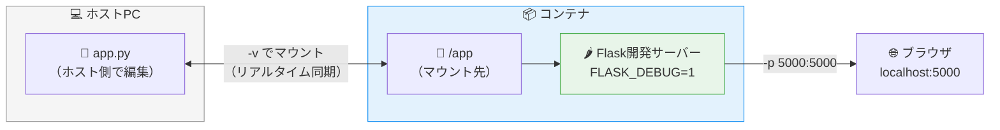

> **`COPY` と `-v` の使い分け：** `COPY` は **ビルド時にイメージへファイルを焼き込む** ため、本番配布用イメージに向いています。`-v` でのマウントは **実行時にホスト側の最新ファイルをそのまま見せる** ため、開発中のホットリロード用途に最適です。今回のように開発中はマウント、配布時は `COPY` と使い分けます。

> **ハンズオンの進め方：** セクション8では `docker-compose.yml` を使ったJupyterLab構築を体験します。Dockerfileから直接ビルドする方法は、上記の `docker build` → `docker run -v` で実際にお試しください。

---

## 7. docker-compose

### docker-composeとは

**docker-compose** は、複数のコンテナをまとめて管理するツールです。`docker-compose.yml` というYAMLファイルに設定を記述し、`docker-compose up` の1コマンドで起動できます。

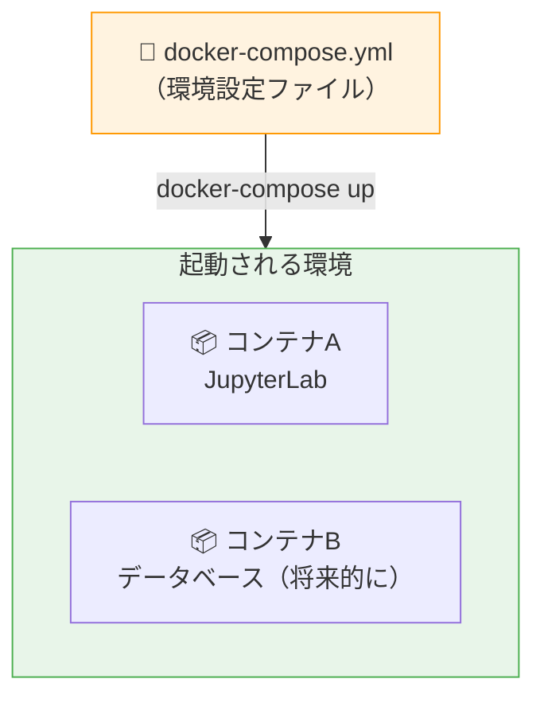

### docker runとdocker-composeの違い

| | `docker run` | `docker-compose` |
|--|-------------|-----------------|
| 設定の記述 | コマンドラインに直接オプションを書く | YAMLファイルに記述（再利用可能） |
| 複数コンテナ | コンテナごとにコマンドを実行 | 1コマンドで複数コンテナを起動 |
| Gitとの相性 | バージョン管理しにくい | YAMLファイルをGitで管理できる |
| チームでの共有 | コマンドを共有する必要がある | ファイルを共有するだけでOK |

### docker-compose.yml の基本構造

```yaml
version: '3.8'          # docker-composeのバージョン

services:               # 起動するコンテナの定義
  サービス名:            # コンテナの名前（任意）
    image: イメージ名   # 使用するDockerイメージ
    ports:             # ポートマッピング
      - "ホスト:コンテナ"
    volumes:           # フォルダのマウント
      - ./ホスト側:コンテナ側
    environment:       # 環境変数
      - KEY=VALUE
    command: コマンド   # 起動時に実行するコマンド
```

### docker-composeの主要コマンド

```bash
# コンテナを起動する（フォアグラウンド：ログが表示される）
docker-compose up

# コンテナをバックグラウンドで起動する
docker-compose up -d

# 起動中のコンテナを停止してコンテナを削除する
docker-compose down

# コンテナのログを確認する
docker-compose logs

# 起動中のコンテナの一覧を確認
docker-compose ps
```

### YAMLファイルの書き方のポイント

```yaml
# ✅ インデントはスペース2つ（タブは使わない）
services:
  jupyter:
    image: continuumio/anaconda3

# ✅ リスト（配列）はハイフン「-」で記述
ports:
  - "8888:8888"

volumes:
  - ./notebooks:/notebooks

# ❌ タブ文字を使うとエラーになる
services:
	jupyter:    ← これはNG（タブ）
```

---

## 8. ハンズオン：JupyterLab環境を構築する

### 目標

`docker-compose.yml` を使って、Anaconda + JupyterLab のPython環境をコンテナ上に構築する。ローカルのフォルダをマウントして、作成したNotebookをPC上に保存できることを確認する。

### 環境の全体像

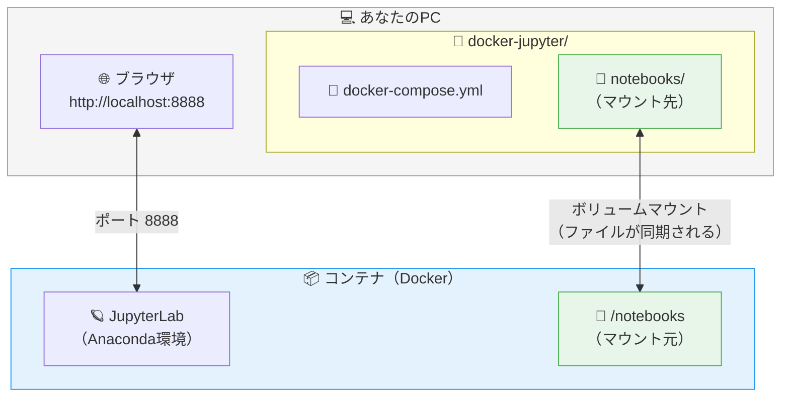

**ポイント：**
- ブラウザからポート8888でJupyterLabにアクセスする
- `notebooks/` フォルダがコンテナと同期されるため、コンテナを削除してもNotebookはPCに残る

### フォルダ構成

```
docker-jupyter/
├── docker-compose.yml     ← 講師が配布（編集不要）
└── notebooks/             ← 自分で作成（空のフォルダでOK）
```

### 手順

#### Step 1: フォルダを作成する

```bash
# 任意の場所にプロジェクトフォルダを作成
mkdir docker-jupyter
cd docker-jupyter

# notebooksフォルダを作成（マウント先）
mkdir notebooks

# フォルダ構成を確認
ls
```

#### Step 2: docker-compose.yml を配置する

講師から配布された `docker-compose.yml` を `docker-jupyter` フォルダに置きます。

ファイルの内容を確認します：

```bash
cat docker-compose.yml
```

```yaml
version: '3.8'

services:
  jupyter:
    image: continuumio/anaconda3      # AnacondaのDockerイメージを使用
    container_name: jupyter-lab
    ports:
      - "8888:8888"                   # PC側の8888番ポート → コンテナの8888番ポート
    volumes:
      - ./notebooks:/notebooks        # PC側のnotebooks/ → コンテナの/notebooks
    working_dir: /notebooks           # コンテナ内の作業ディレクトリ
    command: >
      /bin/bash -c "
      pip install jupyterlab &&
      jupyter lab
      --ip=0.0.0.0
      --port=8888
      --no-browser
      --allow-root
      --NotebookApp.token=''
      --NotebookApp.password=''
      "
    restart: unless-stopped
```

**各設定の意味：**

| 設定 | 値 | 意味 |
|------|-----|------|
| `image` | `continuumio/anaconda3` | Docker HubのAnaconda公式イメージを使用 |
| `ports` | `"8888:8888"` | ブラウザからアクセスするためのポート公開 |
| `volumes` | `./notebooks:/notebooks` | PCのnotebooks/フォルダとコンテナを同期 |
| `working_dir` | `/notebooks` | コンテナ内の作業フォルダ |
| `--ip=0.0.0.0` | — | コンテナ外（ブラウザ）からのアクセスを許可 |
| `--NotebookApp.token=''` | — | 認証トークンなし（勉強会用の設定） |

#### Step 3: コンテナを起動する

```bash
docker-compose up
```

初回はAnacondaイメージ（約3GB）のダウンロードが発生します。  
以下のような表示が出たらダウンロード中です：

```
Pulling jupyter (continuumio/anaconda3:)...
latest: Pulling from continuumio/anaconda3
...
```

JupyterLabが起動すると以下のような表示が出ます：

```
jupyter-lab  | [I 2026-05-01 10:00:00.000 ServerApp] Jupyter Server is running at:
jupyter-lab  | [I 2026-05-01 10:00:00.000 ServerApp] http://localhost:8888/lab
```

#### Step 4: JupyterLabにアクセスする

ブラウザで以下のURLを開きます：

```
http://localhost:8888
```

JupyterLabの画面が表示されれば成功です。

#### Step 5: Notebookを作成して動作確認する

1. JupyterLabの画面で「Python 3（ipykernel）」をクリックして新しいNotebookを作成
2. セルに以下のコードを入力して実行（`Shift + Enter`）：

```python
print("Hello from Docker!")

import sys
print(f"Python バージョン: {sys.version}")

import numpy as np
print(f"NumPy バージョン: {np.__version__}")
```

3. 正常に実行されればOKです

#### Step 6: ファイルがPCに保存されているか確認する

別のターミナルを開いて確認します：

```bash
cd docker-jupyter
ls notebooks/
# → 作成したNotebookファイル（.ipynb）が表示されればOK
```

#### Step 7: コンテナを停止する

ターミナルで `Ctrl + C` を押した後：

```bash
docker-compose down
```

コンテナが停止・削除されますが、`notebooks/` フォルダのファイルはPCに残ります。

---

## 9. ハンズオン：Dev Containerを使ってみる

### Dev Containerとは

**Dev Container（開発コンテナ）** は、VS Codeの拡張機能を使って**Dockerコンテナの中で直接コードを書く・実行する**仕組みです。

「コンテナの中に入って開発する」というイメージです。

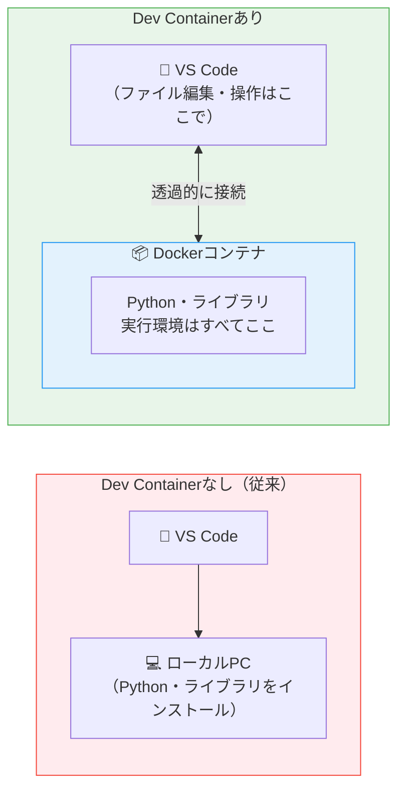

**ポイント：** VS Codeの画面はいつも通り使えますが、コードの実行はコンテナの中で行われます。ローカルPCにPythonやライブラリをインストールしなくてもよくなります。

---

### docker-composeとDev Containerの違い

| | docker-compose + JupyterLab | Dev Container |
|--|---------------------------|---------------|
| 編集ツール | ブラウザ上のJupyterLab | VS Code（使い慣れたエディタ） |
| 実行環境 | コンテナ内 | コンテナ内 |
| 用途 | データ分析・Notebook作業 | コード開発・ファイル編集全般 |
| Git操作 | ターミナルでコマンド | VS CodeのGit機能がそのまま使える |
| 拡張機能 | JupyterLabの拡張のみ | VS Codeの拡張機能が使える |

> **使い分けの目安：** データ分析・実験的な作業はJupyterLab（docker-compose）、本格的な開発・コードを書く作業はDev Containerが向いています。

---

### Dev Containerの全体像

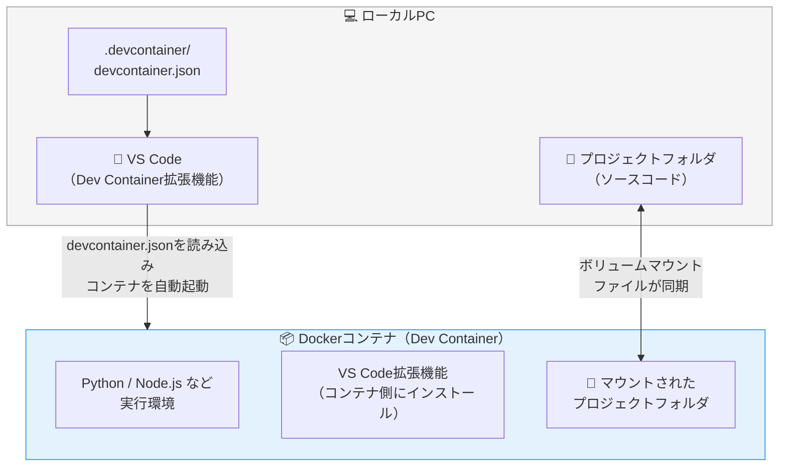

---

### 必要なもの

| 必要なもの | 確認方法 |
|-----------|---------|
| Docker Desktop（起動済み） | タスクトレイのクジラアイコン |
| VS Code | 勉強会第2回でインストール済み |
| VS Code拡張機能「Dev Containers」 | 後述のインストール手順参照 |

---

### Dev Containers 拡張機能のインストール

1. VS Codeを開く
2. 左サイドバーの「拡張機能」アイコンをクリック（または `Ctrl + Shift + X`）
3. 検索欄に「Dev Containers」と入力
4. 「Dev Containers」（作者：Microsoft）をインストール
5. インストール後、左サイドバーの一番下に `><` のようなアイコンが追加される

---

### `.devcontainer/` フォルダの構成

Dev Containerの設定は、プロジェクトフォルダ内の `.devcontainer/` フォルダに置きます。

```
my-project/                        ← プロジェクトフォルダ
├── .devcontainer/                 ← Dev Container設定フォルダ
│   ├── devcontainer.json          ← Dev Containerの設定ファイル（必須）
│   └── Dockerfile                 ← カスタムイメージを使う場合（任意）
├── src/
│   └── main.py
└── requirements.txt
```

---

### devcontainer.json の書き方

`devcontainer.json` は Dev Containerの設定を記述するファイルです。今回は **既存のDockerイメージを使うシンプルな構成** を1つだけ取り上げます。

JSON標準ではコメントが書けませんが、`devcontainer.json` は **JSONC（JSON with Comments）形式** に対応しているため、`//` を使ったコメントを書くことができます。

```jsonc
{
  // この Dev Container の名前（VS Code左下に表示される）
  "name": "Python Dev Container",

  // 使用するDockerイメージ（Microsoft公式のPython 3.11入りイメージ）
  // Docker Hubの "mcr.microsoft.com/devcontainers/python:3.11" を自動でpullする
  "image": "mcr.microsoft.com/devcontainers/python:3.11",

  // コンテナ内のVS Codeに関する設定
  "customizations": {
    "vscode": {
      // コンテナ起動時に自動インストールするVS Code拡張機能
      // ローカル側ではなく "コンテナ側" にインストールされる点に注意
      "extensions": [
        "ms-python.python",          // Python言語サポート
        "ms-python.black-formatter"  // Pythonコードフォーマッター（black）
      ]
    }
  },

  // コンテナ作成後に1回だけ実行されるコマンド
  // 例：requirements.txtがあればここでまとめてpip install するのが定番
  "postCreateCommand": "pip install --upgrade pip",

  // コンテナ内のポートをホスト（ローカルPC）に転送する
  // 例：Flaskで8000番を使う場合、ブラウザから http://localhost:8000 で開ける
  "forwardPorts": [8000]
}
```

#### 主な設定項目

| キー | 意味 | 例 |
|------|------|----|
| `name` | Dev Containerの名前 | `"Python Dev Container"` |
| `image` | 使用するDockerイメージ | `"mcr.microsoft.com/devcontainers/python:3.11"` |
| `customizations.vscode.extensions` | コンテナ内にインストールするVS Code拡張機能 | Pythonプラグインなど |
| `postCreateCommand` | コンテナ作成後に1回実行するコマンド | `"pip install -r requirements.txt"` |
| `forwardPorts` | ホストに転送するポート | `[8000, 8888]` |
| `remoteUser` | コンテナ内で使用するユーザー | `"vscode"` |

> **応用：** `image` の代わりに `dockerComposeFile` や `build.dockerfile` を指定すると、自前の `docker-compose.yml` や `Dockerfile` を使ったDev Containerも作れます。今回は触れませんが、興味があれば公式ドキュメントを参照してください。

---

### ハンズオン手順：Dev Containerを実際に起動する

ここからは実際に手を動かして、配布済みの `my-project/` フォルダから Dev Container を起動してみます。事前に勉強会リポジトリを `git pull` した状態で進めてください。

#### Step 1: 配布済みファイルを確認する

`Docker勉強会/my-project/` 配下に、以下のファイルがあることを確認します。

```
Docker勉強会/my-project/
├── .devcontainer/
│   └── devcontainer.json    ← Dev Container の設定（コメント付き）
├── hello.py                 ← 動作確認用スクリプト
└── README.md                ← ハンズオン補足
```

PowerShellで確認する場合：

```powershell
cd Docker勉強会\my-project
ls -Force            # .devcontainer は隠しフォルダ風になるので -Force で表示
cat .\.devcontainer\devcontainer.json
```

> **配布物をそのまま使ってOK：** ファイルを自作する必要はありません。中身を読み、編集してみる流れで学習します。

#### Step 2: VS Code 拡張機能「Dev Containers」をインストールする（未インストールの場合）

1. VS Codeの左サイドバー「拡張機能」アイコン（または `Ctrl + Shift + X`）を開く
2. 検索欄に `Dev Containers` と入力
3. **「Dev Containers」（作者：Microsoft）** をインストール
4. インストール後、VS Codeの **左下に `><` 形のアイコン** が表示されることを確認

#### Step 3: VS Codeで `my-project` フォルダを開く

メニュー「ファイル」→「フォルダーを開く」から、`Docker勉強会/my-project` フォルダを開きます。

> **ポイント：** リポジトリ全体（`git-practice-repo`）を開くのではなく、**`my-project` フォルダだけ** を開くのが推奨です。Dev Containersは「開いているフォルダ直下の `.devcontainer/`」を見にいくため、別フォルダを開くと検知されません。

#### Step 4: コンテナで再オープンする

1. 左下の **`><` アイコンをクリック**
   - または `Ctrl + Shift + P` でコマンドパレットを開き、`Dev Containers: Reopen in Container` を選択
2. 「Reopen in Container（コンテナーで再度開く）」を選ぶ
3. 初回は Microsoft の Python イメージ（数百MB）のpullが走るため、数分かかります
4. 完了するとVS Codeが再読み込みされ、左下の表示が **`Dev Container: Python Dev Container`** に変わります

#### Step 5: コンテナ内で動作確認する

1. VS Codeのメニュー「ターミナル」→「新しいターミナル」でターミナルを開く
2. プロンプトが `vscode ➜ /workspaces/my-project $` のように **コンテナ内のシェル** になっていることを確認
3. 以下のコマンドを実行する：

```bash
# コンテナのOSを確認（DebianベースのLinuxになっているはず）
cat /etc/os-release

# Pythonのバージョンを確認
python --version
# → Python 3.11.x

# 用意されたスクリプトを実行
python hello.py
```

正しく動けば「Hello from Dev Container!」と Python のバージョンが表示されます。

#### Step 6: ホスト側にファイルが反映されることを確認する

コンテナ内で `hello.py` を編集（例：表示文を変える）して保存したあと、**コンテナ外（ホスト側）のPowerShell** で同じファイルを開いて変更が反映されていることを確認します。

```powershell
# ホスト側のPowerShellで（VS Code外でも可）
cat Docker勉強会\my-project\hello.py
```

プロジェクトフォルダはマウントされているため、コンテナ内の編集はホスト側にもそのまま現れます。

#### Step 7: コンテナから抜ける／停止する

- **ローカルに戻る：** VS Code左下の `Dev Container: ...` をクリックし、`Reopen Folder Locally`（ローカルでフォルダーを再度開く）を選択
- **コンテナを停止：** ローカルに戻った後、Docker Desktop または `docker ps` で対象コンテナを確認し `docker stop` で停止できます
- 再びコンテナで開きたい場合は、Step 4 の操作をもう一度実行するだけでOKです

#### Step 8: 設定を変えてみる（任意）

慣れてきたら、`.devcontainer/devcontainer.json` を編集して以下を試してみましょう。変更後は左下のアイコンから **`Rebuild Container`** を選ぶと反映されます。

- `extensions` に `"ms-toolsai.jupyter"` を追加してJupyter拡張を入れる
- `postCreateCommand` を `"pip install pandas numpy"` に変更してライブラリを自動インストールする
- `forwardPorts` に追加のポートを足して、コンテナ内のサーバーをホストから開けるようにする

> **チェックポイント：** Step 5 で `python --version` が `3.11.x` と表示され、`hello.py` が実行できれば成功です。ローカルPCにPythonをインストールしていなくても、コンテナ内の環境がそのまま使えていることを確認できます。

---

### Dev Containerを起動する手順（参考フロー図）

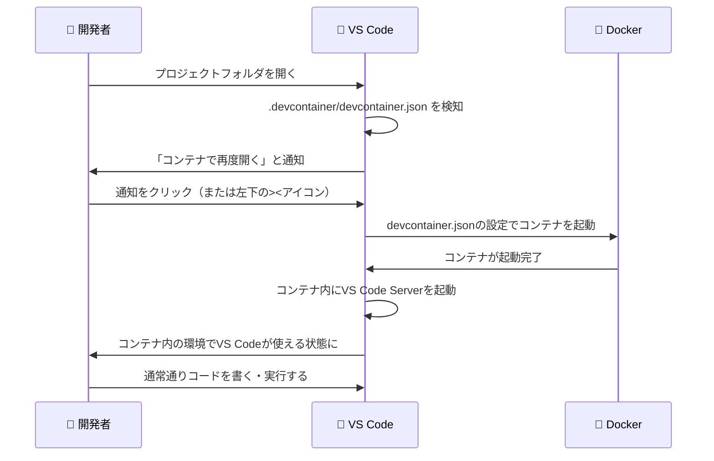

左下の表示で「コンテナ内で作業中」かどうかが一目でわかります：

```
ローカル:    > <   ← ローカルで開いている状態
コンテナ内:  > Dev Container: Python Dev Container  ← コンテナ内で開いている状態
```

---

### Dev Containerのメリット

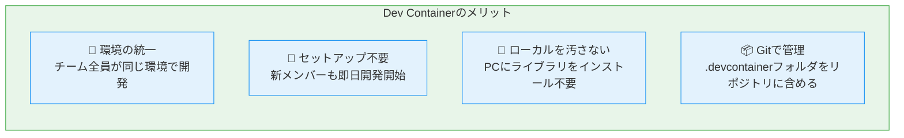

**私たちの業務での活用例：**
- 内製開発のチーム全員が同じPython環境で開発できる
- `.devcontainer/` フォルダをGitで管理することで、環境定義もバージョン管理される
- 新しいメンバーが参加したとき、Git cloneしてVS Codeで開くだけで即座に開発開始できる

---

### Gitとの連携

Dev Container内でもVS CodeのGit機能はそのまま使えます。

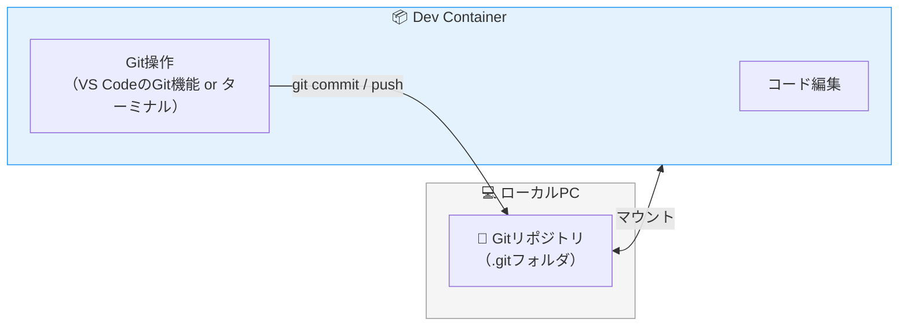

プロジェクトフォルダはマウントされているため、コンテナ内でコミット・プッシュしても、ローカルのGitリポジトリに反映されます。

---

## 10. よく使うDockerコマンド一覧

### イメージ操作

| コマンド | 説明 |
|---------|------|
| `docker images` | ローカルのイメージ一覧を表示 |
| `docker pull イメージ名` | イメージをDocker Hubから取得 |
| `docker build -t 名前 .` | Dockerfileからイメージをビルド |
| `docker rmi イメージ名` | イメージを削除 |

### コンテナ操作

| コマンド | 説明 |
|---------|------|
| `docker run イメージ名` | コンテナを作成して起動 |
| `docker run -d イメージ名` | バックグラウンドで起動 |
| `docker run -p 8888:8888 イメージ名` | ポートを公開して起動 |
| `docker run -v ./ホスト:/コンテナ イメージ名` | フォルダをマウントして起動 |
| `docker ps` | 実行中のコンテナ一覧 |
| `docker ps -a` | 全コンテナ一覧（停止中含む） |
| `docker stop コンテナ名` | コンテナを停止 |
| `docker start コンテナ名` | 停止中のコンテナを起動 |
| `docker rm コンテナ名` | コンテナを削除 |
| `docker exec -it コンテナ名 bash` | 実行中のコンテナの中に入る |
| `docker logs コンテナ名` | コンテナのログを確認 |

### docker-compose操作

| コマンド | 説明 |
|---------|------|
| `docker-compose up` | コンテナを起動（フォアグラウンド） |
| `docker-compose up -d` | コンテナをバックグラウンドで起動 |
| `docker-compose down` | コンテナを停止・削除 |
| `docker-compose ps` | 起動中のコンテナ一覧 |
| `docker-compose logs` | ログを確認 |
| `docker-compose logs -f` | ログをリアルタイムで確認 |

---

## 11. FAQ

**Q: イメージとコンテナの違いがわかりません。**  
A: イメージは「設計図・型紙」、コンテナはその設計図をもとに作った「実体」です。料理でいうとイメージがレシピ、コンテナが作った料理に相当します。1つのレシピから何皿でも料理が作れるように、1つのイメージから複数のコンテナを作れます。

**Q: コンテナを削除するとデータも消えますか？**  
A: コンテナ内に保存したデータは、コンテナを削除すると消えます。データを残したい場合は、ハンズオンで体験したように `volumes` でPCのフォルダをマウントする必要があります。

**Q: `docker run` と `docker-compose up` の使い分けは？**  
A: 基本的に`docker-compose`を使うことを推奨します。設定をYAMLファイルに記述できるため、チームで共有しやすく、Gitで管理もできます。`docker run` は簡単な動作確認のときに使います。

**Q: `docker-compose down` と `docker stop` の違いは？**  
A: `docker stop` はコンテナを停止するだけで削除はしません。`docker-compose down` はコンテナを停止して削除します。どちらの場合もマウントしたフォルダのデータは残ります。

**Q: コンテナを再起動してもJupyterLabの設定は保持されますか？**  
A: `docker-compose down` → `docker-compose up` を実行すると、`pip install jupyterlab` が再実行されます。今回の設定では毎回インストールが走るため、起動に時間がかかります。高速化したい場合はDockerfileでイメージをカスタマイズします。

**Q: Dockerと仮想マシン（VMware等）の違いは？**  
A: 仮想マシンはOS全体を仮想化するため重いですが、Dockerはホス トOSのカーネルを共有するため軽量で起動が速いです。ただし、DockerはLinuxコンテナが基本であり、WindowsアプリをDockerで動かすことは基本的にできません。

**Q: Docker Hubのイメージは無料で使えますか？**  
A: 公式イメージ（`python`・`node`・`mysql`など）は無料で利用できます。Docker Hubのアカウント登録（無料）でpullの回数制限を緩和できます。

**Q: Dev Containerとdocker-composeは何が違いますか？**  
A: docker-composeはコンテナを「起動・管理」するツールです。Dev ContainerはVS Codeをコンテナ内に接続して「開発」するための仕組みで、内部的にdocker-composeやDockerfileを使います。両者は組み合わせて使うこともできます。

**Q: Dev Container内でGit操作はできますか？**  
A: できます。プロジェクトフォルダはローカルPCからマウントされているため、コンテナ内でgit commit・pushしてもローカルのGitリポジトリに反映されます。VS CodeのGitパネルもコンテナ内で通常通り使えます。

**Q: Dev Containerを終了するとファイルは消えますか？**  
A: プロジェクトフォルダはマウントされているため、コンテナを停止・削除してもファイルはローカルPCに残ります。コンテナ内で別途インストールしたパッケージ（`pip install`など）は消えますが、`devcontainer.json` の `postCreateCommand` に記載しておくことで、次回起動時に自動でインストールされます。

**Q: `.devcontainer/` フォルダはGitで管理すべきですか？**  
A: はい、管理することを推奨します。チームメンバーが同じリポジトリをcloneするだけで同一の開発環境を再現できるようになります。これがDev Containerの最大のメリットの1つです。

---

*作成日：2026年*  
*対象：情報システム部 Docker勉強会*
