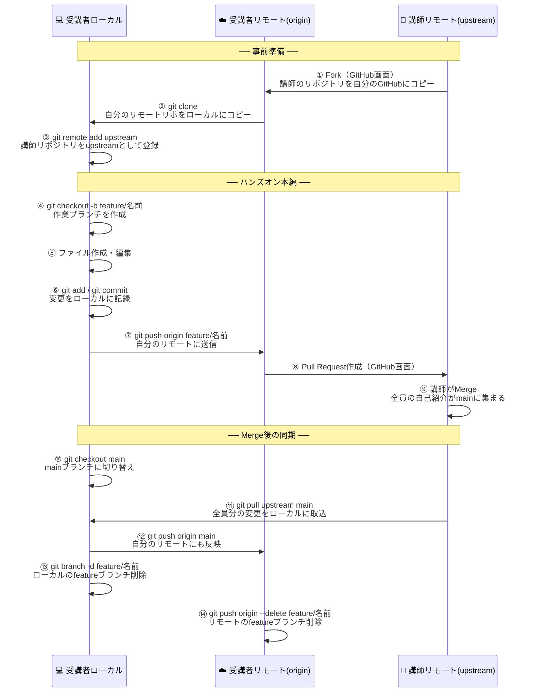
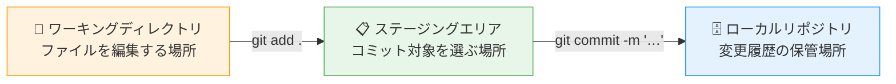

# Git 勉強会資料 第2回

**対象者：** 情報システム部員（Git初心者）  
**所要時間：** 1時間  
**日時：** 2026年5月25日 10:00-11:00

---

## 目次

0. [事前準備（勉強会前日まで）](#0-事前準備勉強会前日まで)
1. [第1回ハンズオン振り返り](#1-第1回ハンズオン振り返り)
2. [VS CodeでGitを使う](#2-vs-codeでgitを使う)

---

## 0. 事前準備（勉強会前日まで）

### VS Code のダウンロード・インストール

第2回ではVS CodeでGitを操作します。勉強会当日までに完了してください。

#### インストール手順
次のサイトの手順に従ってVSCodeをインストールする
https://qiita.com/ryosuke_tsuda/items/11fd5965e4c965f67e0c


#### インストールの確認

VS Codeを起動し、メニュー「ターミナル」→「新しいターミナル」を開いて以下を実行してください：

```bash
git --version
```

以下のように表示されればOKです：

```
git version 2.47.1.windows.1
```

（バージョン番号は多少異なっていても問題ありません）

#### 事前準備チェックリスト

- [ ] VS Codeがインストールされており、起動できる
- [ ] VS Codeのターミナルで `git --version` が実行できる
- [ ] 第1回でcloneした `git-practice-repo` フォルダがローカルに残っている

---

## 1. 第1回ハンズオン振り返り

### 1-1. ハンズオンの全体像

第1回では、Fork → Clone → ブランチ作成 → コミット → Push → Pull Request → Merge という一連の流れを体験しました。さらに、講師のリポジトリにマージされた全員の変更を自分のローカル・リモートに反映する手順まで実施しました。

以下のシーケンス図で全体の流れを確認します。



---

### 1-2. Gitコマンドの解説

ハンズオンで使用したコマンドを順番に振り返ります。各コマンドが「何をしているのか」を確認してください。

---

#### 【事前準備】

---

##### ① Fork（GitHub画面操作）

Gitコマンドではなく、**GitHubのブラウザ画面上の操作**です。

| 項目 | 内容 |
|------|------|
| 操作 | 講師のGitHubリポジトリ右上の「Fork」ボタンをクリック |
| 何が起きるか | 講師のリポジトリが**自分のGitHubアカウントにコピーされる** |
| コピー先 | `https://github.com/【自分のユーザー名】/git-practice-repo` |

> **イメージ：** GitHubのサーバー上で「コピー」が実行される操作です。自分のPCには何も変化しません。

---

##### ② `git clone`

```bash
git clone https://github.com/【自分のGitHubユーザー名】/git-practice-repo.git
cd git-practice-repo
```

| 項目 | 内容 |
|------|------|
| 意味 | リモートリポジトリを**自分のPCにダウンロード**する |
| 何が起きるか | `git-practice-repo` フォルダが作成され、中に `.git` フォルダも作られる |
| 自動設定 | クローン元のURLが `origin` という名前で自動登録される |

> **イメージ：** GitHubにある自分のリポジトリを、ローカルPC上に「複製」する操作です。

```bash
# cloneした直後にリモートの登録状況を確認する
git remote -v
# → origin が自分のリモートリポジトリのURLになっていればOK
```

---

##### ③ `git remote add upstream`

```bash
git remote add upstream https://github.com/KenjiTakamura-nw/git-practice-repo.git
git remote -v
```

| 項目 | 内容 |
|------|------|
| 意味 | リモートリポジトリに**ニックネームをつけて登録**する |
| `upstream` | 講師（フォーク元）のリポジトリにつけたニックネーム |
| `origin` | 自分のリモートリポジトリ（cloneで自動設定済み）のニックネーム |

`git remote -v` の出力例：
```
origin    https://github.com/【自分のユーザー名】/git-practice-repo.git (fetch)
origin    https://github.com/【自分のユーザー名】/git-practice-repo.git (push)
upstream  https://github.com/KenjiTakamura-nw/git-practice-repo.git (fetch)
upstream  https://github.com/KenjiTakamura-nw/git-practice-repo.git (push)
```

> **ポイント：** `origin` も `upstream` も単なる**ニックネーム**です。URLの省略形として使えます。`git pull upstream main` と書くことで、長いURLを毎回入力しなくて済みます。

---

#### 【ハンズオン本編】

---

##### ④ `git checkout -b feature/名前`

```bash
git checkout -b feature/yamada-taro
```

| 項目 | 内容 |
|------|------|
| 意味 | 新しいブランチを**作成して、そのブランチに切り替える** |
| `-b` | 「branch（ブランチ）を新しく作る」オプション |
| `feature/yamada-taro` | ブランチ名（`/` の後ろが作業内容や担当者名） |

実行後、Git Bashのプロンプトが変わります：
```
# 実行前
~/Documents/git-practice-repo (main)

# 実行後
~/Documents/git-practice-repo (feature/yamada-taro)
```

> **ポイント：** 括弧の中がブランチ名です。`(main)` から `(feature/yamada-taro)` に変わったことで、mainブランチとは別の作業ラインで作業していることがわかります。

---

##### ⑤ ファイルの作成・編集

Git Bashのコマンドではなく、**エクスプローラーやエディタでの操作**です。

```
introductions/yamada-taro.md   ← 新規作成
```

ブランチを切り替えると、エクスプローラーに表示されるファイルも切り替わります。これはGitが `.git` フォルダの情報をもとにワーキングディレクトリのファイルを書き換えているためです。

---

##### ⑥ `git add` / `git commit`

```bash
# ステージングエリアに追加する（コミットするファイルを選ぶ）
git add .

# 状態を確認する（addの前後で表示が変わる）
git status

# ローカルリポジトリにスナップショットとして記録する
git commit -m "yamada-taroの自己紹介ファイルを追加"

# コミット履歴を確認する
git log --oneline
```

**`git add` と `git commit` の違い：**

| コマンド | 場所 | 意味 |
|---------|------|------|
| `git add` | ワーキングディレクトリ → ステージングエリア | コミットしたいファイルを「選ぶ」 |
| `git commit` | ステージングエリア → ローカルリポジトリ | 選んだ変更を「記録する」 |



> **`git add .` の `.` は「現在フォルダ以下すべて」の意味です。** 特定ファイルだけ追加したい場合は `git add introductions/yamada-taro.md` のようにファイル名を指定します。

> **コミットメッセージの書き方：** 「何をしたか」が後から見てわかる内容にしましょう。日本語でも英語でも構いません。例：`「yamada-taroの自己紹介ファイルを追加」`

---

##### ⑦ `git push origin feature/名前`

```bash
git push origin feature/yamada-taro
```

| 項目 | 内容 |
|------|------|
| 意味 | ローカルのブランチを**リモートリポジトリ（origin）に送信する** |
| `origin` | 自分のGitHubリポジトリのニックネーム |
| `feature/yamada-taro` | 送信するブランチ名 |

> **イメージ：** ローカルで記録したコミットを、GitHubにアップロードする操作です。pushして初めて他の人が見られる状態になります。

---

##### ⑧ Pull Request作成（GitHub画面操作）

Gitコマンドではなく、**GitHubのブラウザ画面上の操作**です。

| 項目 | 内容 |
|------|------|
| 意味 | 「自分のブランチの変更を、講師のmainブランチにマージしてほしい」というリクエスト |
| 確認ポイント | `base repository` が `KenjiTakamura-nw/git-practice-repo`、`base` が `main` になっていること |

> **Pull Requestのメリット：** マージ前にdiff（差分）を画面上で確認できます。レビューコメントを残すこともできます。

---

##### ⑨ 講師がMerge（GitHub画面操作）

講師がGitHub画面上で「Merge pull request」ボタンを押すことで、各受講者のブランチの変更が講師のリポジトリの `main` ブランチに統合されます。

---

#### 【Merge後の同期】

---

##### ⑩ `git checkout main`

```bash
git checkout main
```

| 項目 | 内容 |
|------|------|
| 意味 | `main` ブランチに**切り替える** |
| なぜ必要か | `git pull upstream main` でmainブランチを最新にするため、事前にmainに移動しておく |

---

##### ⑪ `git pull upstream main`

```bash
git pull upstream main
```

| 項目 | 内容 |
|------|------|
| 意味 | `upstream`（講師リポジトリ）の `main` ブランチの変更を**ローカルに取り込む** |
| `upstream` | 講師のリポジトリのニックネーム |
| `main` | 取り込むブランチ名 |

> **なぜ `origin` ではなく `upstream` なのか？**  
> 全員の変更がマージされているのは講師のリポジトリ（upstream）です。自分のリモート（origin）はまだ自分のfeatureブランチしかpushしていないため、`origin` からpullしても全員分の変更は取得できません。

---

##### ⑫ `git push origin main`

```bash
git push origin main
```

| 項目 | 内容 |
|------|------|
| 意味 | ローカルの `main` ブランチを**自分のリモートリポジトリ（origin）に送信する** |
| なぜ必要か | ⑪でローカルのmainは最新になったが、自分のGitHub（origin）にはまだ反映されていないため |

---

##### ⑬ `git branch -d feature/名前`

```bash
git branch -d feature/yamada-taro
```

| 項目 | 内容 |
|------|------|
| 意味 | **ローカルの**featureブランチを削除する |
| `-d` | 「マージ済みのブランチのみ削除する」安全なオプション（未マージの場合はエラーになる） |
| なぜ削除するか | PRがマージされてmainに取り込まれたため、featureブランチは不要になる |

---

##### ⑭ `git push origin --delete feature/名前`

```bash
git push origin --delete feature/yamada-taro
```

| 項目 | 内容 |
|------|------|
| 意味 | **リモート（origin）の**featureブランチを削除する |
| `--delete` | リモートのブランチを削除するオプション |
| なぜ必要か | ⑬はローカルの削除のみ。リモートのブランチは別途削除が必要 |

> **ブランチの削除はローカルとリモートで別々の操作が必要です。** ⑬と⑭はセットで実行しましょう。

---

### 1-3. コマンドまとめ（コピペ用）

```bash
# ===== Merge後の同期 =====

# ① mainブランチに切り替える
git checkout main

# ② 講師リポジトリ（upstream）の最新をローカルのmainに取り込む
git pull upstream main

# ③ 自分のリモートリポジトリ（origin）にも反映する
git push origin main

# ④ ローカルのfeatureブランチを削除する（マージ済みのみ削除可）
git branch -d feature/【自分の名前】

# ⑤ リモート（origin）のfeatureブランチも削除する
git push origin --delete feature/【自分の名前】
```

---

## 2. VS CodeでGitを使う

### 2-1. VS CodeのGit統合機能とは

VS Code（Visual Studio Code）には**Gitの操作を視覚的に行える機能**が標準で搭載されています。第1回で学んだコマンドをGUIで実行できるため、日常的な作業がより直感的になります。

**Git BashとVS Codeの使い分け：**

| 操作 | Git Bash | VS Code |
|------|----------|---------|
| add・commit・push | コマンドで実行 | ボタン操作で実行可能 |
| ブランチ切り替え | `git checkout ブランチ名` | 左下のブランチ名をクリック |
| コミット履歴の確認 | `git log --oneline --graph` | Git Graph拡張で視覚的に確認 |
| diff確認 | `git diff` | ファイルをクリックすると左右で差分表示 |
| 複雑な操作（rebase等） | コマンドが確実 | 非推奨（リスクが高い） |

> **推奨：** 仕組みの理解にはGit Bash、日常作業の効率化にはVS Codeが向いています。コマンドの意味を理解した上でVS Codeを使うのがおすすめです。

---

### 2-2. VS Codeの主要画面

#### ① ソース管理パネル（左サイドバー）

左サイドバーのブランチアイコン（または `Ctrl + Shift + G`）でソース管理パネルを開きます。

| 表示 | 対応するコマンド | 意味 |
|------|----------------|------|
| 「変更」セクションのファイル一覧 | `git status` | 変更されたファイルの一覧 |
| ファイル横の `+` ボタン | `git add ファイル名` | ステージングに追加 |
| 「ステージされた変更」のファイル一覧 | `git add` 済みの状態 | コミット対象のファイル |
| メッセージ欄に入力して `✓ コミット` | `git commit -m "..."` | コミットの実行 |

#### ② 左下のブランチ表示

```
⎇ main          ← 現在のブランチ名
```

クリックするとブランチの一覧が表示され、選択するだけで `git checkout` と同じ操作ができます。

#### ③ diff（差分）表示

ソース管理パネルのファイル名をクリックすると、変更前後の差分が**左右並べて表示**されます。削除した行が赤、追加した行が緑で色分けされます。

---

### 2-3. Git Graph 拡張機能（インストール推奨）

VS Codeの拡張機能「**Git Graph**」を導入すると、コミット履歴とブランチの状態をグラフィカルに表示できます。

**Git Graphでできること：**
- ブランチの分岐・マージをグラフで視覚的に確認（`git log --all --oneline --graph` のGUI版）
- 各コミットをクリックして変更内容を確認
- 各コミットのメッセージ・日時・作者を一覧表示

#### インストール手順

1. VS Codeを開く
2. 左サイドバーの「拡張機能」アイコン（四角のマーク）をクリック（または `Ctrl + Shift + X`）
3. 検索欄に「Git Graph」と入力
4. 「Git Graph」（作者：mhutchie）をクリックして「インストール」
5. インストール完了後、ソース管理パネルの上部に「Git Graph」ボタンが追加される

---

### 2-4. VS CodeでGitを使う手順

#### add と commit をVS Codeで行う

```
1. ファイルを編集・保存する（Ctrl + S）
2. 左サイドバーのソース管理アイコンをクリック
3. 「変更」セクションに変更ファイルが表示される
4. コミットしたいファイルの横の「＋」をクリック
   → 「ステージされた変更」に移動する（= git add）
5. 上部のメッセージ入力欄にコミットメッセージを入力
6. 「✓ コミット」ボタンをクリック（= git commit）
```

#### push をVS Codeで行う

```
7. ソース管理パネルの「…」（三点リーダー）メニューをクリック
8. 「プッシュ」を選択（= git push origin 現在のブランチ名）
```

または、左下のブランチ名の横に表示される「↑」アイコンをクリックでもpushできます。

#### ブランチを切り替える

```
1. 左下のブランチ名（例：⎇ main）をクリック
2. ブランチの一覧が表示される
3. 切り替えたいブランチ名を選択（= git checkout ブランチ名）
```

#### 新しいブランチを作成する

```
1. 左下のブランチ名をクリック
2. 「＋ 新しいブランチの作成...」を選択
3. ブランチ名を入力してEnter（= git checkout -b ブランチ名）
```

---

### 2-5. VS Codeターミナルの活用

VS CodeにはGit Bashと同様のターミナルが内蔵されています。メニュー「ターミナル」→「新しいターミナル」で開けます。

GUIとコマンドを組み合わせることもできます。

```bash
# VS Codeのターミナルで実行できる（Git Bashと同じコマンドが使える）
git log --oneline
git pull upstream main
git push origin --delete feature/yamada-taro
```

---

### 2-6. ハンズオン（VS Codeを使ったGit操作）

第1回と同じリポジトリを使って、VS Codeでの操作を体験します。

#### 手順

```
① VS Codeで git-practice-repo フォルダを開く
   → メニュー「ファイル」→「フォルダーを開く」→ git-practice-repo を選択

② 左下のブランチ表示が「⎇ main」になっていることを確認

③ 新しいブランチを作成する
   → 左下のブランチ名をクリック → 「＋ 新しいブランチの作成...」
   → ブランチ名を入力（例：feature/vscode-test）

④ introductions フォルダに新しいファイルを作成・編集する
   → エクスプローラーパネルから新規ファイルを作成
   → 内容を入力して保存（Ctrl + S）

⑤ ソース管理パネルでaddとcommitを行う
   → 変更ファイルの「＋」をクリック（add）
   → メッセージを入力して「✓ コミット」（commit）

⑥ Git Graphでコミット履歴を確認する
   → ソース管理パネルの「Git Graph」ボタンをクリック

⑦ pushする
   → 「…」メニュー →「プッシュ」

⑧ GitHubでPull Requestを作成する（第1回と同様）
```

---

## FAQ

**Q: VS CodeとGit Bashはどちらを使えばいいですか？**  
A: 両方使えることが理想です。仕組みの理解にはGit Bash、日常作業の効率化にはVS Codeが向いています。Git Bashでコマンドの意味を理解した上でVS Codeに移行するのがおすすめです。

**Q: `git pull upstream main` と `git pull origin main` の違いは？**  
A: `upstream` は講師（フォーク元）のリポジトリ、`origin` は自分のリモートリポジトリです。全員の変更が講師のリポジトリにマージされた後は、`upstream` からpullすることで全員分の変更を取り込めます。

**Q: featureブランチを削除するタイミングは？**  
A: Pull Requestがマージされた後が適切なタイミングです。`git branch -d` はマージ済みブランチしか削除できないため、誤って未マージのブランチを削除するリスクがありません。ローカルとリモートの両方を削除するのを忘れずに。

**Q: Git Graphをインストールしてもボタンが表示されません。**  
A: VS Codeを再起動してください。それでも表示されない場合は、拡張機能パネルで「Git Graph」が有効になっているか確認してください。

**Q: VS CodeでpushしたときにGitHubの認証を求められました。**  
A: GitHubのユーザー名とPersonal Access Token（パスワードの代わりに使うトークン）を入力してください。通常はブラウザが開いてGitHub認証画面が表示されます。

---

*作成日：2026年5月*  
*対象：情報システム部 Git勉強会（第2回）*
