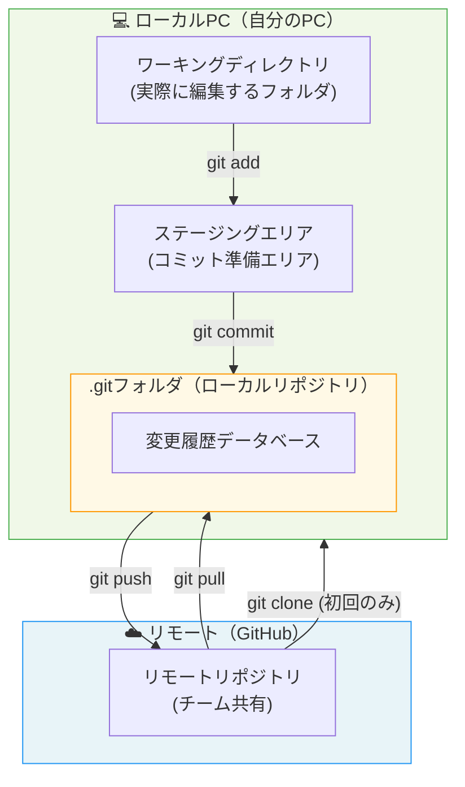
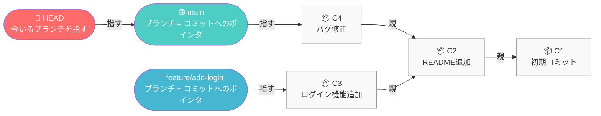
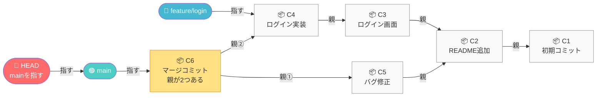
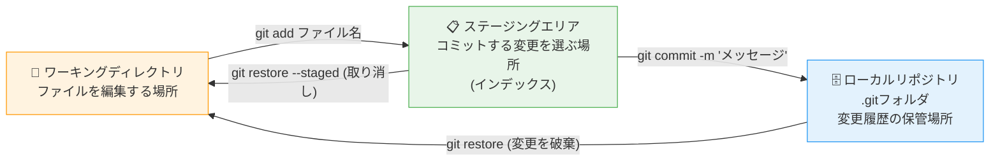
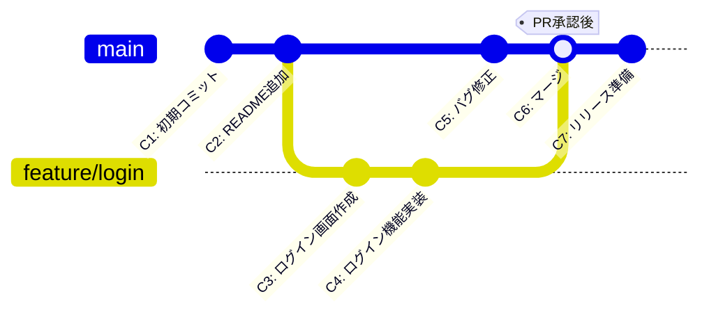
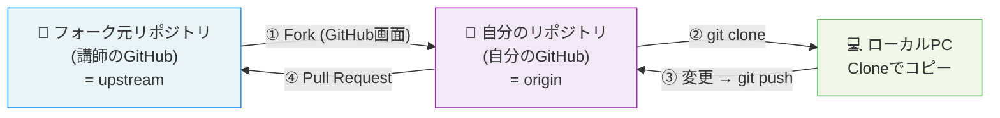
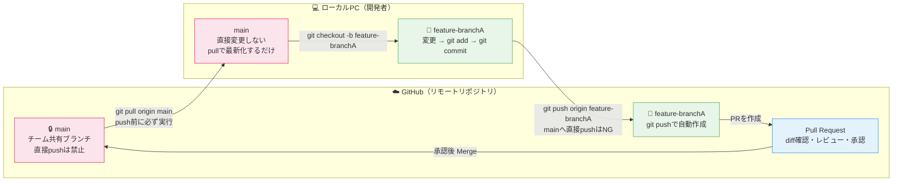
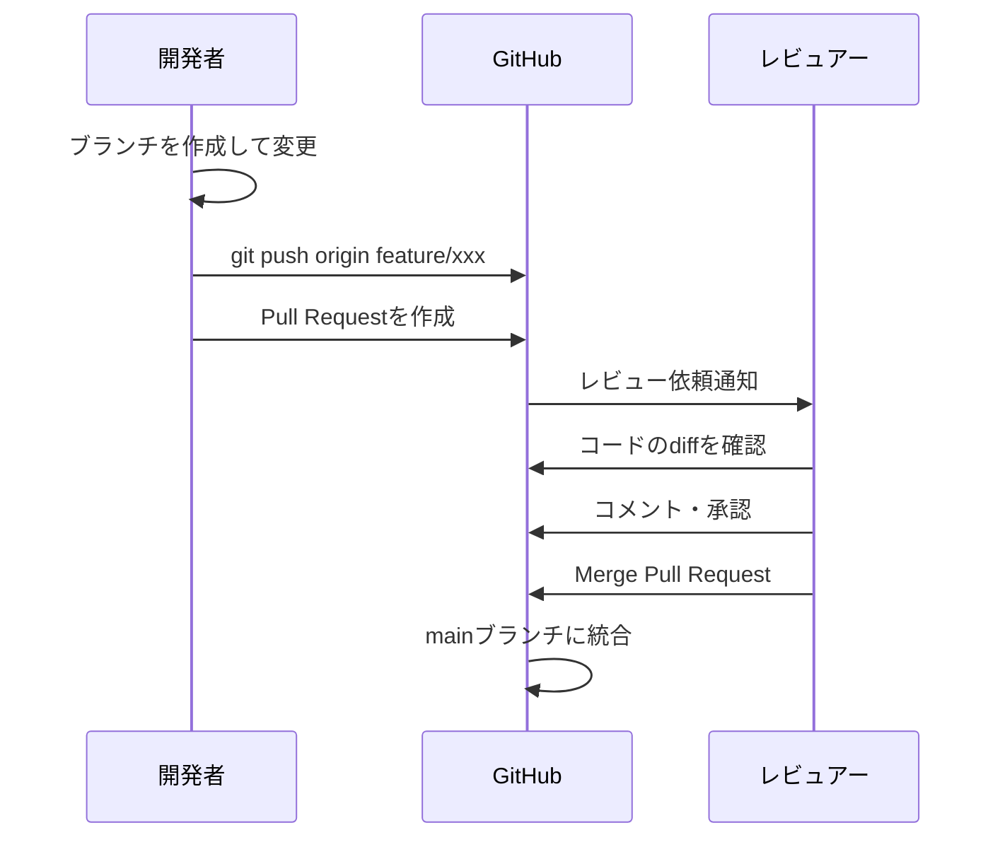
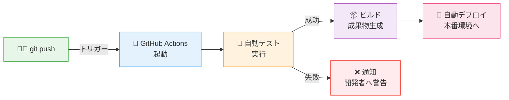
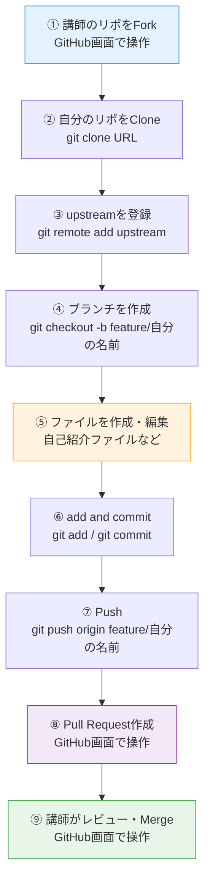

# Git 勉強会資料

**対象者：** 情報システム部員（Git初心者）  
**所要時間：** 1時間  
**日時：** 2026年4月  

---

## 目次

1. [Gitとは・Gitのメリット](#1-gitとはgitのメリット)
2. [リポジトリとは](#2-リポジトリとは)
3. [コミットとは（Gitの内部構造）](#3-コミットとはgitの内部構造)
4. [ワーキングディレクトリとステージングエリア](#4-ワーキングディレクトリとステージングエリア)
5. [基礎コマンドを実際に打ってみよう](#5-基礎コマンドを実際に打ってみよう)
6. [Gitブランチ](#6-gitブランチ)
7. [Fork・クローン・マージ](#7-forkクローンマージ)
8. [Gitフォルダのエクスプローラーからの見え方](#8-gitフォルダのエクスプローラーからの見え方)
9. [システム開発におけるGitの使い方](#9-システム開発におけるgitの使い方)
10. [GitHub（リポジトリホスティングサービス）](#10-githubリポジトリホスティングサービス)
11. [プルリクエスト → Merge](#11-プルリクエスト--merge)
12. [GitHubの各種機能](#12-githubの各種機能)
13. [CI/CDパイプラインへの拡張性](#13-cicdパイプラインへの拡張性)
14. [注意事項（.gitignore）](#14-注意事項gitignore)
15. [ハンズオン](#15-ハンズオン)
16. [FAQ](#16-faq)
17. [よく使うGitコマンド一覧](#17-よく使うgitコマンド一覧)

---

## 1. Gitとは・Gitのメリット

### Gitとは

**Git** は、ファイルの変更履歴を管理する**分散型バージョン管理システム**です。  
2005年にLinuxカーネルの開発者であるLinus Torvaldsが開発しました。現在はソフトウェア開発の現場で世界標準として使われています。

### Gitのメリット

| メリット | 説明 |
|---------|------|
| **バージョン管理** | ファイルの変更履歴をすべて記録。いつでも過去の状態に戻せる |
| **diff確認** | 「どのファイルの、どの行が、どう変わったか」を一目で確認できる |
| **Gitワークフロー** | ブランチを使って複数の作業を並行して進められる |
| **分散開発** | 複数人が同時に開発でき、変更を安全に統合できる |

### システム開発での活用場面（私たちの仕事）

- **要件定義・設計書の管理** → ドキュメントの変更履歴を追える
- **内製開発** → ソースコードのバージョン管理
- **ベンダーとの協働** → プルリクエストでレビューが可能
- **成果物の共有** → GitHubでチーム全員がアクセス

---

## 2. リポジトリとは

**リポジトリ（Repository）** とは、ファイルと変更履歴をまとめて保管する「入れ物」です。

### ローカルリポジトリとリモートリポジトリ



### .gitフォルダとは

`git init` または `git clone` を実行すると、プロジェクトフォルダの中に **`.git`** という隠しフォルダが作られます。

- この `.git` フォルダの中に**すべての変更履歴**が保存されます
- `.git` フォルダを削除すると、Git管理が失われます（ファイル自体は残る）
- 通常はエクスプローラーでは非表示（隠しファイル設定が必要）

---

## 3. コミットとは（Gitの内部構造）

### コミットとは

**コミット（commit）** とは、ある時点のファイルの状態を**スナップショット（写真）として記録**する操作です。

- コミットするたびに、新しいコミットが作成される
- 各コミットには一意の**コミットID（ハッシュ値）**が付く（例：`a1b2c3d`）
- コミットメッセージで「何を変更したか」を記録する

### コミットの内部構造 ― ポインタとHEAD



### ポイント

| 概念 | 説明 |
|------|------|
| **コミット** | ファイルのスナップショット。前のコミット（親）へのリンクを持つ |
| **ブランチ** | 特定のコミットを指す**ポインタ**（付箋のようなもの） |
| **HEAD** | 今自分が作業しているブランチを指す**ポインタ** |

> **たとえ話：** コミットは「セーブポイント」、ブランチは「そのセーブポイントに貼った名前シール」、HEADは「今どのシールを使っているか」のマーカーです。

### マージとは（内部構造）

**マージ（merge）** とは、2つのブランチの変更を統合する操作です。  
マージすると、**2つの親コミットを持つ「マージコミット」** が新たに作られます。



| ポイント | 説明 |
|---------|------|
| **マージコミット（C6）** | 2つの親（C5とC4）を持つ特別なコミット |
| **mainブランチのポインタ** | マージ後、mainはC6（マージコミット）を指すように移動する |
| **featureブランチ** | マージ後も削除するまで残り続ける（C4を指したまま） |

> **まとめ：** マージとは「2つのブランチの歴史を1つにつなぐ操作」です。  
> Gitの内部では、2つの親を持つコミットを作ることで実現しています。

---

## 4. ワーキングディレクトリとステージングエリア



### なぜステージングエリアがあるのか

複数のファイルを変更したとき、**コミットしたいファイルだけを選んで**記録できます。  
例：5ファイルを変更したが、3ファイルだけをまとめて1つのコミットにしたい場合。

### git status でまず状態を確認する習慣

`git add` する前に、必ず `git status` で現在の状態を確認しましょう。

```bash
git status
```

実行例：
```
On branch feature/login
Changes not staged for commit:
        modified:   README.md

Untracked files:
        introductions/yamada-taro.md
```

| 表示 | 意味 |
|------|------|
| `modified:` | 既存ファイルが変更されている |
| `Untracked files:` | Gitに未登録の新規ファイル |
| `Changes to be committed:` | ステージング済み（コミット待ち） |

> **`git add .` の注意点：** `git add .` はカレントフォルダ以下の全変更を一括追加できて便利ですが、**意図しないファイル（テスト用データ、一時ファイルなど）を含めてしまうリスク**があります。`git status` で変更内容を確認してから add する習慣をつけましょう。

---

## 5. 基礎コマンドを実際に打ってみよう

### 初期設定（初回のみ）

```bash
# ユーザー名とメールアドレスを設定する（GitHubアカウントと合わせる）
git config --global user.name "あなたのGitHubユーザー名"
git config --global user.email "あなたのメールアドレス"

# 設定確認
git config --global --list
```

### GitHubの認証方式について（HTTPS）

今回の勉強会では **HTTPS** を使ってGitHubと通信します。

### 基本的な操作の流れ

```bash
# 1. リポジトリの状態を確認（addの前に必ず実行する）
git status

# 2. 変更ファイルをステージングに追加
git add ファイル名       # 特定のファイルを追加（推奨）
git add .              # カレントフォルダ以下すべてを追加（注意：git statusで確認してから）

# 3. コミット（スナップショットを作成）
git commit -m "変更内容の説明（日本語OK）"

# 4. コミット履歴を確認
git log --oneline

# 5. リモートへ送る
git push origin ブランチ名

# 6. リモートの最新を取得
git pull origin main
```

### コミットメッセージの書き方

コミットメッセージは「**何をしたか**」を簡潔に書きます。

| NG例 | OK例 |
|------|------|
| `修正` / `update` | `ログイン画面のバリデーションを追加` |
| `作業中` | `README：セットアップ手順を追記` |
| `aaa` | `設計書：要件定義書の承認フローを修正` |

- 日本語・英語どちらでもよい（チームのルールに合わせる）
- 動詞から始めると分かりやすい（「追加」「修正」「削除」「更新」など）
- 将来の自分やチームメンバーが読んで理解できる内容にする

---

## 6. Gitブランチ

### ブランチとは

**ブランチ（branch）** は、開発の「作業ライン」を分岐させる機能です。  
本線（main）を壊さずに、新機能開発・修正作業を並行して進められます。

### ブランチ・コミット・マージのイメージ



### ブランチの基本コマンド

```bash
# ブランチの一覧を表示
git branch

# 新しいブランチを作成して切り替える
git checkout -b feature/新機能名

# ブランチを切り替える
git checkout main

# 現在のブランチにマージする
git merge feature/新機能名

# ブランチを削除する
git branch -d feature/新機能名
```

### ブランチ命名の例

| ブランチ名 | 用途 |
|-----------|------|
| `main` | 本番相当のブランチ（直接変更しない） |
| `develop` | 開発の統合ブランチ |
| `feature/ログイン機能` | 新機能開発 |
| `fix/バグ修正` | バグ修正 |

---

## 7. Fork・クローン・マージ

### 各概念の整理

| 操作        | 説明                           | 場所          |
| --------- | ---------------------------- | ----------- |
| **Fork**  | 他人のリモートリポを自分のGitHubアカウントにコピー | リモート→リモート   |
| **Clone** | リモートリポを自分のPCにコピー             | リモート→ローカル   |
| **Merge** | 2つのブランチの変更を統合する              | ローカルまたはリモート |

### 用語解説：upstream・フォーク元リポジトリ

| 用語                     | 説明                                                      |
| ---------------------- | ------------------------------------------------------- |
| **upstream（アップストリーム）** | forkの参照元となるリポジトリの呼び名。「上流」という意味で、変更が流れてくる元のリポジトリを指す      |
| **フォーク元リポジトリ**         | Forkする前の元のリポジトリ。技術用語では **upstream** と呼ぶ。「本家リポジトリ」とも呼ばれる |
| **origin**             | `git clone` したときに自動で付く名前。自分のリモートリポジトリ（Forkしたもの）を指す      |

> **まとめると：** 自分のGitHub上のForkしたリポジトリが **origin**、Fork元（講師のリポジトリ）が **upstream** です。

### git remote add upstream

```bash
# フォーク元のリポジトリ（upstream）をローカルに登録するコマンド
git remote add upstream https://github.com/【フォーク元のユーザー名】/【リポジトリ名】.git

# 登録確認（originとupstreamが表示されればOK）
git remote -v
```

出力例：
```
origin    https://github.com/【自分のユーザー名】/git-practice-repo.git (fetch)
origin    https://github.com/【自分のユーザー名】/git-practice-repo.git (push)
upstream  https://github.com/KenjiTakamura-nw/git-practice-repo.git (fetch)
upstream  https://github.com/KenjiTakamura-nw/git-practice-repo.git (push)
```

upstreamを登録しておくことで、フォーク元の最新変更を取り込めます：

```bash
# フォーク元（upstream）の最新をローカルのmainに反映する
git fetch upstream
git merge upstream/main
```

### Fork → Clone → PR の流れ



### Forkを使うケースと使わないケース

| ワークフロー | 使う場面 | 流れ |
|------------|---------|------|
| **Fork型**（今回のハンズオン） | OSSへの貢献、外部リポジトリへの参加 | Fork → Clone → ブランチ → PR |
| **共有リポジトリ型**（社内開発の一般的な形） | チーム内の内製開発 | Clone → ブランチ → PR |

> **社内開発では通常Forkは使いません。** チームで1つの共有リポジトリを作り、全員がそのリポジトリをcloneして作業ブランチを切るフローが一般的です。今回Forkを使うのは、GitHubの操作を幅広く体験するためです。

---

## 8. Gitフォルダのエクスプローラーからの見え方

### Windowsエクスプローラーでの見え方

`git init` や `git clone` を実行したフォルダには、`.git` という**隠しフォルダ**が作成されます。

**表示方法：**
1. エクスプローラーを開く
2. 「表示」タブ → 「隠しファイル」にチェック
3. `.git` フォルダが表示される

```
プロジェクトフォルダ/
├── .git/              ← 隠しフォルダ（変更履歴がすべてここに）
│   ├── HEAD           ← 現在のブランチ情報
│   ├── config         ← リポジトリの設定
│   ├── objects/       ← コミットのデータ
│   └── refs/          ← ブランチのポインタ情報
├── README.md
├── requirements.md
└── design.md
```

> **注意：** `.git` フォルダは絶対に手動で削除・変更しないでください。Git管理の全履歴が失われます。

---

## 9. システム開発におけるGitの使い方

### 私たちの業務での活用イメージ

チームで開発する際は「ローカルで変更 → リモートに反映 → リモートの最新をローカルに取り込む」というサイクルを繰り返します。  
**mainブランチはチーム全員が共有するブランチ**のため、直接変更せず、必ず作業ブランチを使います。



### 開発サイクルのルール

| ルール | 理由 |
|--------|------|
| **mainブランチをローカルで直接変更しない** | mainは他のメンバーが随時更新する共有ブランチのため |
| **作業前・push前に必ずgit pullする** | 自分の変更と他者の変更が衝突（コンフリクト）しないように |
| **リモートのmainへ直接pushしない** | Pull Requestを通じてレビューを受けてからマージする |
| **機能・タスクごとにブランチを作る** | 作業の独立性を保ち、問題が起きても他に影響しない |

### Gitワークフロー（GitHub Flow）

1. `main` ブランチから作業用ブランチを作成
2. 変更を加えてコミット
3. GitHubにプッシュ（push前にpullを忘れずに）
4. Pull Requestを作成してレビューを依頼
5. 承認されたら `main` にマージ

---

## 10. GitHub（リポジトリホスティングサービス）

### GitとGitHubの違い

| | Git | GitHub |
|--|-----|--------|
| **種別** | ソフトウェア（ツール） | Webサービス |
| **役割** | バージョン管理の仕組み | Gitリポジトリのクラウドホスティング |
| **提供者** | オープンソース（コミュニティ） | Microsoft（2018年～） |
| **使い方** | ローカルPC上で動作 | ブラウザからアクセス |

### GitHubでできること

- リモートリポジトリのホスティング（無料プランあり）
- ブラウザからコードのdiff確認
- Pull Request（コードレビュー）
- Issue（タスク・バグ管理）
- GitHub Actions（CI/CD自動化）
- GitHub Projects（プロジェクト管理）

---

## 11. プルリクエスト → Merge

### プルリクエスト（Pull Request / PR）とは

**作業ブランチの変更を、本線ブランチ（main）にマージしてほしい**というリクエストです。  
GitHubの画面上でdiff（差分）を確認しながらレビューできます。

### PRの流れ



### PRの作成手順（GitHub画面操作）

1. GitHubのリポジトリページを開く
2. 「Pull requests」タブ → 「New pull request」
3. `base: main` ← `compare: feature/xxx` を選択
4. タイトル・説明を記入して「Create pull request」
5. レビュアーが確認 → 「Merge pull request」

### なぜPRを使うのか ― mainブランチ保護の考え方

「mainに直接pushしない」「PRを通してマージする」のには明確な理由があります。

| 理由 | 説明 |
|------|------|
| **品質管理** | 変更を第三者がレビューすることで、誤りや抜け漏れを事前に検出できる |
| **変更の記録** | 誰が・何を・なぜ変更したかの意思決定履歴がPRに残る |
| **事故防止** | 誤ったコードや設計書が本番相当のmainに直接入るリスクをゼロにできる |
| **知識共有** | レビューを通じてチーム全員が変更内容を把握できる |

#### GitHubのブランチ保護（Branch Protection Rules）

GitHubの設定でmainブランチへの直接pushを**システム的に禁止**することができます。

設定場所：リポジトリ → Settings → Branches → Add branch protection rule

| 主な設定項目 | 効果 |
|------------|------|
| `Require a pull request before merging` | 直接pushを禁止・PR必須 |
| `Require approvals` | ○名以上の承認がないとMerge不可 |
| `Require status checks to pass` | テスト成功後のみMerge可能（CI連携） |

> **内製開発を管理する立場になったとき、** まずブランチ保護ルールを設定することを推奨します。「PRを通じてレビューする文化」をルールで担保することが、品質管理の第一歩です。

---

## 12. GitHubの各種機能

### Issues（イシュー）

- タスク・バグ・要望を管理するチケットシステム
- 「#番号」でコミットやPRとリンクできる
- ラベル・担当者・マイルストーンで整理可能
- **活用例：** 設計書の修正依頼、開発タスクの管理

### GitHub Actions（アクション）

- コードのプッシュやPR作成をトリガーに**自動処理を実行**
- **活用例：**
  - テストの自動実行
  - ドキュメントの自動生成・デプロイ
  - Slackへの通知

### GitHub Projects（プロジェクト）

- IssueとPRをカンバンボードやロードマップで管理
- スプリント計画・進捗管理に活用可能
- **活用例：** システム開発プロジェクトのタスク管理

---

## 13. CI/CDパイプラインへの拡張性

### CI/CD とは

| 略語 | 意味 | 説明 |
|------|------|------|
| **CI** | Continuous Integration（継続的インテグレーション） | コードの変更を自動でテスト・ビルド |
| **CD** | Continuous Delivery/Deployment（継続的デリバリー/デプロイ） | テストが通ったら自動で環境に展開 |

### GitHub Actionsを使ったCI/CDの例



将来的には、設計書やドキュメントの変更をGitで管理し、承認フローをGitHubのPR + Actionsで自動化することも可能です。

---

## 14. 注意事項（.gitignore）

### .gitignoreとは

GitHubにアップロード**したくないファイル・フォルダ**を指定するファイルです。

### 必ず除外すべきもの

```gitignore
# 環境設定ファイル（パスワード・APIキーが含まれる）
.env
.env.local
config/secrets.yml

# パスワード・認証情報ファイル
credentials.json
*.pem
*.key

# OSが自動生成するファイル
.DS_Store          # Mac
Thumbs.db          # Windows

# 開発ツールが生成するファイル
node_modules/
__pycache__/
*.pyc
```

### .gitignoreの作成方法

1. プロジェクトのルートフォルダに `.gitignore` というファイルを作成
2. 除外したいファイル・フォルダのパターンを記載
3. `git add .gitignore` してコミット

> **重要：** 一度GitHubにアップしてしまったファイルは、`.gitignore` に追加しても履歴からは消えません。機密情報は最初から除外する習慣をつけましょう。

---

## 15. ハンズオン

### 目標

講師が作成したリモートリポジトリに対して、**Fork → Clone → 変更 → Push → Pull Request** の一連の流れを体験する。

> **今回のワークフローについて：** 今回はGitHubの操作を幅広く体験するためにFork型ワークフローを採用します。ただし、**社内開発では通常Forkは使わず**、共有リポジトリをcloneしてブランチを切るシンプルなフローが一般的です（セクション7参照）。

### ハンズオン用リポジトリ

```
https://github.com/KenjiTakamura-nw/git-practice-repo
```

### ハンズオンの流れ



### 手順詳細

#### Step 1: Fork（GitHub画面）

1. 以下のURLをブラウザで開く  
   **`https://github.com/KenjiTakamura-nw/git-practice-repo`**
2. 右上の「Fork」ボタンをクリック
3. 「Create fork」をクリック
4. 自分のGitHubアカウントにリポジトリがコピーされたことを確認  
   （URLが `https://github.com/【自分のユーザー名】/git-practice-repo` に変わればOK）

#### Step 2: Clone（Git Bash）

```bash
# 自分のGitHubのリポジトリページから「Code」ボタン → HTTPSのURLをコピー
git clone https://github.com/【自分のGitHubユーザー名】/git-practice-repo.git

# クローンしたフォルダに移動
cd git-practice-repo

# リモートの確認（originが自分のリポジトリになっていればOK）
git remote -v
```

> **認証について（HTTPS）：** 初回の `git clone` や `git push` 時にブラウザが自動で開き、GitHubの認証画面が表示される場合があります（Git Credential Manager による認証）。画面に従ってサインインを完了してください。認証に失敗した場合は講師に声をかけてください。

#### Step 3: upstreamの登録（フォーク元リポジトリを登録）

```bash
# 講師のリポジトリ（フォーク元）をupstreamとして登録
git remote add upstream https://github.com/KenjiTakamura-nw/git-practice-repo.git

# 確認（originが自分、upstreamが講師のリポになっていればOK）
git remote -v
```

#### Step 4: ブランチ作成 → 変更 → コミット

```bash
# mainブランチから自分の作業ブランチを作成
git checkout -b feature/【自分の名前（英字）】

# ファイルを作成（例：introductionsフォルダに自己紹介ファイルを作成）
# エクスプローラーでファイルを作成してもOK
# ファイル名例: introductions/yamada-taro.md

# 状態を確認（addの前に必ず実行！変更ファイルを目視確認する）
git status

# ステージングに追加（今回は自己紹介ファイル1つだけなので一括でOK）
git add .

# コミット（「何をしたか」が分かるメッセージを書く）
git commit -m "【自分の名前】の自己紹介ファイルを追加"

# コミット履歴を確認
git log --oneline
```

#### Step 5: Push → Pull Request

```bash
# 自分のリモートリポ（origin）にプッシュ
git push origin feature/【自分の名前（英字）】
```

1. GitHubの自分のリポジトリページを開く
2. 「Compare & pull request」ボタンが表示されたらクリック
3. タイトルと説明を入力
4. **送り先（base repository）が `KenjiTakamura-nw/git-practice-repo` になっていることを確認**
5. 「Create pull request」をクリック
6. 講師のレビューを待つ

---

## 16. FAQ

**Q: commitのメッセージは何語で書けばいいですか？**  
A: チームのルールに従いましょう。日本語でも英語でも構いません。大切なのは「何をなぜ変更したか」が分かること。例：`「ログイン機能：パスワードバリデーションを追加」`

**Q: git addとgit commitの違いは？**  
A: `git add` は「コミットしたいファイルを選ぶ（ステージング）」、`git commit` は「選んだファイルの状態をスナップショットとして保存する」操作です。

**Q: pushとpullの違いは？**  
A: `push` はローカルの変更をリモートに送る、`pull` はリモートの最新をローカルに取得する操作です。

**Q: ブランチはいつ作ればいいですか？**  
A: 新しいタスクや機能を始めるときに都度作成します。作業が終わってマージしたら削除します。

**Q: コンフリクト（競合）が起きたらどうすれば？**  
A: 同じファイルの同じ箇所を複数人が変更したときに発生します。ファイルを開いてどちらの変更を採用するか（または両方を生かすか）を判断し、`git add` → `git commit` で解決します。

**Q: 間違えてコミットしてしまったら？**  
A: まだpushしていなければ `git reset HEAD~1` で直前のコミットを取り消せます。pushした後は慎重に対応が必要です（チームに相談を）。

**Q: ForkとCloneの違いは？**  
A: `Fork` はGitHub上で他人のリポジトリを自分のGitHubアカウントにコピーする操作。`Clone` はリモートリポジトリをローカルPCにコピーする操作です。

**Q: originとupstreamの違いは？**  
A: `origin` は自分のGitHub上のリポジトリ（Forkしたもの）、`upstream` はFork元のリポジトリ（今回は講師のリポジトリ）です。

---

## 17. よく使うGitコマンド一覧

### 初期設定

| コマンド | 説明 |
|---------|------|
| `git config --global user.name "名前"` | ユーザー名を設定 |
| `git config --global user.email "メール"` | メールアドレスを設定 |
| `git config --global --list` | 設定内容を確認 |

### リポジトリの作成・取得

| コマンド | 説明 |
|---------|------|
| `git init` | 現在のフォルダをGitリポジトリにする |
| `git clone [URL]` | リモートリポジトリをクローン |
| `git remote -v` | リモートリポジトリの一覧を表示 |
| `git remote add origin [URL]` | 自分のリモートリポジトリを登録 |
| `git remote add upstream [URL]` | フォーク元リポジトリ（upstream）を登録 |

### 状態確認

| コマンド | 説明 |
|---------|------|
| `git status` | ワーキングディレクトリの状態を確認 |
| `git log --oneline` | コミット履歴を1行で表示 |
| `git log --all --oneline --graph` | ブランチを含むコミット履歴をグラフで表示 |
| `git diff` | ワーキングエリアとステージングの差分 |
| `git diff HEAD` | ワーキングエリアと最新コミットの差分 |

### ステージング・コミット

| コマンド | 説明 |
|---------|------|
| `git add ファイル名` | 特定ファイルをステージングに追加 |
| `git add .` | すべての変更をステージングに追加 |
| `git commit -m "メッセージ"` | コミット |
| `git restore --staged ファイル名` | ステージングから取り消す |

### ブランチ操作

| コマンド | 説明 |
|---------|------|
| `git branch` | ブランチ一覧を表示 |
| `git branch ブランチ名` | ブランチを作成 |
| `git checkout ブランチ名` | ブランチを切り替える |
| `git checkout -b ブランチ名` | ブランチを作成して切り替える |
| `git merge ブランチ名` | 現在のブランチに指定ブランチをマージ |
| `git branch -d ブランチ名` | ブランチを削除 |

### リモートとの同期

| コマンド | 説明 |
|---------|------|
| `git push origin ブランチ名` | リモートにプッシュ |
| `git pull origin main` | リモートのmainを取得してマージ |
| `git fetch origin` | リモートの変更を取得（マージはしない） |
| `git fetch upstream` | フォーク元の変更を取得 |
| `git merge upstream/main` | フォーク元のmainをローカルに反映 |

---

*作成日：2026年4月*  
*対象：情報システム部 Git勉強会*
